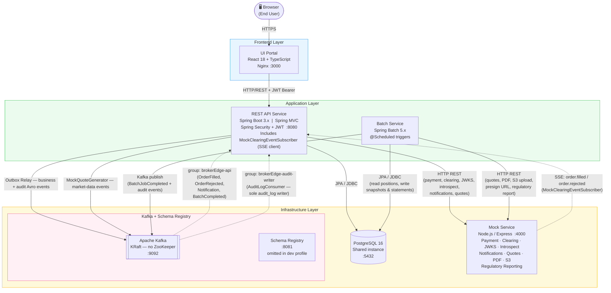

# BrokerEdge Platform
## Full-Stack Application Design Document
*Agentic SDLC Pipeline — Sample Target Application*

**Version 1.0 · July 2026**
*Classification: Internal / Design Reference*

---

## Table of Contents

1. [Executive Summary](#1-executive-summary)
2. [Purpose & Scope of This Document](#2-purpose--scope-of-this-document)
3. [Application Component Justification](#3-application-component-justification)
4. [Domain Model & Bounded Contexts](#4-domain-model--bounded-contexts)
   - [4.1 Core Bounded Contexts](#41-core-bounded-contexts)
   - [4.2 Aggregate Design Principles](#42-aggregate-design-principles)
5. [Clean Architecture Layer Mapping](#5-clean-architecture-layer-mapping)
   - [5.1 Layer Definitions](#51-layer-definitions)
   - [5.2 Package Structure Convention](#52-package-structure-convention)
6. [Component Designs](#6-component-designs)
   - [6.1 REST API Service](#61-rest-api-service) — design patterns, package structure, Spring config, data models, audit responsibilities
   - [6.2 Database](#62-database) — Flyway migrations, index strategy, JPA annotation conventions, audit store ownership
   - [6.3 Event Publisher / Subscriber](#63-event-publisher--subscriber-event-bus-service) — patterns, class structure, Kafka config, event payloads, audit transport
   - [6.4 Batch Application](#64-batch-application-batch-processing-service) — patterns, class structure, batch item data models, audit responsibilities
   - [6.5 UI Portal](#65-ui-portal-single-page-application) — patterns, component tree, routing, TypeScript data models, audit responsibilities
   - [6.6 User Experience & Feature Scope](#66-user-experience--feature-scope)
7. [Microservice Architecture & Service Map](#7-microservice-architecture--service-map)
   - [7.1 Service Decomposition](#71-service-decomposition)
   - [7.2 Local Docker Compose Stack](#72-local-docker-compose-stack)
   - [7.3 Service Architecture & Dependency Diagram](#73-service-architecture--dependency-diagram)
   - [7.4 Audit Trail Design](#74-audit-trail-design)
8. [Test-Driven Development Strategy](#8-test-driven-development-strategy)
   - [8.1 Test Pyramid](#81-test-pyramid)
   - [8.2 TDD Red-Green-Refactor Workflow](#82-tdd-red-green-refactor-workflow)
9. [CI/CD Pipeline Design](#9-cicd-pipeline-design)
   - [9.1 Pipeline Stages](#91-pipeline-stages)
   - [9.2 Jenkinsfile Structure](#92-jenkinsfile-structure)
10. [Mocking Strategy](#10-mocking-strategy)
    - [10.1 Mock Service Architecture](#101-mock-service-architecture)
    - [10.2 External Dependencies Provided by the Mock Service](#102-external-dependencies-provided-by-the-mock-service)
    - [10.3 Admin / Test Control API](#103-admin--test-control-api)
11. [Jira Epic & Feature Breakdown](#11-jira-epic--feature-breakdown)
    - [11.1 Source Control Strategy](#111-source-control-strategy)
    - [11.2 Configuration & Multi-Contributor Setup](#112-configuration--multi-contributor-setup)
12. [Full Technology Stack Summary](#12-full-technology-stack-summary)
13. [Key Design Decisions & Risks](#13-key-design-decisions--risks)
14. [Appendix — Agentic Pipeline Integration Notes](#14-appendix--agentic-pipeline-integration-notes)
15. [Implementation Specifications](#15-implementation-specifications)
    - [15.1 Domain Business Rules](#151-domain-business-rules)
    - [15.2 API Validation Constraints](#152-api-validation-constraints)
    - [15.3 HTTP Status Codes & Error Response Format](#153-http-status-codes--error-response-format)
    - [15.4 Authentication & Session Management Specification](#154-authentication--session-management-specification)
    - [15.5 Maven Multi-Module Structure](#155-maven-multi-module-structure)
    - [15.6 Spring Configuration Reference](#156-spring-configuration-reference)
    - [15.7 Seed Data Specification](#157-seed-data-specification)
    - [15.8 MockQuoteGenerator Specification](#158-mockquotegenerator-specification)
    - [15.9 Mock Service SSE Event Schema](#159-mock-service-sse-event-schema)
    - [15.10 TDD Acceptance Criteria](#1510-tdd-acceptance-criteria)
    - [15.11 Mock Service package.json Dependencies](#1511-mock-service-packagejson-dependencies)
    - [14.1 How BrokerEdge Exercises the Pipeline](#141-how-brokeredge-exercises-the-pipeline)
    - [14.2 Recommended Jira Epic Ingestion Order](#142-recommended-jira-epic-ingestion-order)
16. [Architectural Antipatterns Reference](#16-architectural-antipatterns-reference)
    - [16.1 Accepted Tradeoffs (Documented Technical Debt)](#161-accepted-tradeoffs-documented-technical-debt)
    - [16.2 Antipatterns Fixed in This Design](#162-antipatterns-fixed-in-this-design)
    - [16.3 Antipatterns to Avoid — Developer Agent Rules](#163-antipatterns-to-avoid--developer-agent-rules)

---

## 1 Executive Summary

BrokerEdge is a mock brokerage account management platform that serves as the canonical sample application for the Agentic SDLC Pipeline. Its purpose is twofold: it provides a realistic, domain-rich target system that exercises every stage of the automated pipeline (requirements ingestion, architecture planning, story generation, code generation, pull request creation, and release), while simultaneously demonstrating how a cloud-native, microservice-based financial application is designed and built under Clean Architecture, Domain-Driven Design (DDD), and Test-Driven Development (TDD) principles.

Because many real-world brokerage integrations (market-data feeds, clearing networks, regulatory reporting) are intentionally mocked, BrokerEdge remains buildable and testable in a fully sandboxed environment — making it an ideal pipeline stress-test without the compliance overhead of a live trading system.

---

## 2 Purpose & Scope of This Document

This document covers:

- **Application component justification** — why each of the five components (REST API, Database, Event Bus, Batch Processor, UI Portal) is necessary in a brokerage context
- **Domain model** — the core bounded contexts and aggregates
- **Component-level design** — responsibilities, technology choices, and interface contracts
- **Clean Architecture layer mapping** for each component
- **DDD patterns** applied per bounded context
- **TDD strategy** — test pyramid, tooling, and coverage targets
- **CI/CD pipeline sketch** — GitHub → Jenkins → cloud deployment
- **Mocking strategy** — what is mocked and why
- **Jira epic/feature breakdown** — how this maps to the agentic pipeline input

> **Out of scope:** live regulatory compliance (FINRA/SEC), real market connectivity, actual financial transaction processing, and production security hardening.

---

## 3 Application Component Justification

All five proposed components are necessary. Together they replicate the full technical surface of a production brokerage and give the agentic SDLC pipeline a rich variety of user stories across different architectural patterns.

| Component | Necessary? | Brokerage Rationale | BrokerEdge Role |
|---|---|---|---|
| **REST API** | Essential | Every external consumer (UI, mobile, third-party fintech) communicates via HTTP APIs. Financial regulators increasingly mandate documented, auditable API surfaces. | Core backend exposing all account, order, position, and portfolio operations. The primary integration point for all other components. |
| **Relational Database** | Essential | Brokerage data (accounts, positions, orders, transactions) is highly relational and requires ACID guarantees for monetary consistency. | PostgreSQL stores accounts, users, portfolios, orders, transactions, and audit logs. Managed via JPA/Hibernate with Flyway migrations. |
| **Event Publisher / Subscriber** | Essential | Order lifecycle events, trade confirmations, and account state changes must be propagated asynchronously to multiple consumers (audit, notifications, reporting) without coupling services. | Kafka bus decouples order placement (API) from downstream processors. Demonstrates event-driven microservice patterns core to cloud-native architectures. |
| **Batch Application** | Essential | End-of-day (EOD) settlement, portfolio valuation, statement generation, and reconciliation are industry-standard batch workloads. No brokerage can avoid scheduled processing. | Spring Batch jobs run nightly: EOD position reconciliation, P&L calculation, mock statement generation, and portfolio snapshot archival. |
| **UI Portal** | Essential | Retail brokerage is a consumer-facing business. A portal provides the human-in-the-loop surface that validates UX flows and doubles as the end-to-end acceptance test driver. | React SPA lets a user register, fund an account, place mock orders, view portfolio, and review transaction history — exercising every API endpoint. |

---

## 4 Domain Model & Bounded Contexts

### 4.1 Core Bounded Contexts

BrokerEdge is organised into six bounded contexts following DDD principles. Each context owns its data, publishes domain events, and communicates with peers only through well-defined contracts.

| Bounded Context | Aggregate Roots | Key Domain Events | Owned By |
|---|---|---|---|
| **Identity & Access** | User, Role, Session | UserRegistered, PasswordChanged, SessionCreated | REST API + DB |
| **Account Management** | BrokerageAccount, AccountHolder | AccountOpened, AccountFunded, AccountSuspended | REST API + DB + Events |
| **Order Management** | Order, OrderBook (mock) | OrderPlaced, OrderFilled, OrderCancelled, OrderRejected | REST API + DB + Events |
| **Portfolio & Positions** | Portfolio, Position, Holding | PositionUpdated, PortfolioRebalanced | REST API + DB + Batch |
| **Market Data (Mocked)** | Security, Quote | QuoteUpdated (mock ticker) | Event Publisher (mock) |
| **Reporting & Statements** | Statement, AuditLog | StatementGenerated, AuditEntryCreated | Batch + DB |

### 4.2 Aggregate Design Principles

- Each aggregate enforces its own invariants and emits domain events on state changes.
- Aggregates are persisted via Repository interfaces defined in the Domain layer; implementations live in the Infrastructure layer.
- No aggregate directly references another aggregate by object reference — only by identity (UUID).
- Domain events are published via an in-process `DomainEventPublisher` (Domain layer) and relayed to Kafka via an Infrastructure outbox pattern.

---

## 5 Clean Architecture Layer Mapping

### 5.1 Layer Definitions

Clean Architecture is applied uniformly across all five components. The dependency rule is absolute: inner layers have zero knowledge of outer layers.

| Layer | Contents | Allowed Dependencies |
|---|---|---|
| **Domain** (innermost) | Entities, Value Objects, Aggregates, Domain Events, Repository interfaces, Domain Services | None — pure Java/Kotlin, no framework imports |
| **Application** | Use Cases (interactors), Application Services, DTOs, Port interfaces (input/output) | Domain layer only |
| **Infrastructure** | JPA repositories, Kafka producers/consumers, REST clients (mock market data), Spring configuration | Application + Domain |
| **Interface Adapters** | REST controllers, CLI runners (batch), event listeners, UI API contracts (OpenAPI) | Application layer only |
| **Frameworks & Drivers** (outermost) | Spring Boot, React, PostgreSQL driver, Kafka client, Spring Batch runner | All inner layers |

### 5.2 Package Structure Convention

Each microservice follows the same top-level package layout:

```
com.brokerEdge.<service>/
  domain/
    model/         ← Entities & Value Objects
    event/         ← Domain Events
    repository/    ← Repository interfaces
    service/       ← Domain Services
  application/
    usecase/       ← Use Case interactors
    port/          ← Input & Output Ports
    dto/           ← Request / Response DTOs
  infrastructure/
    persistence/   ← JPA entities & Spring Data repos
    messaging/     ← Kafka producers & consumers
    config/        ← Spring configuration beans
  interfaces/
    rest/          ← Spring MVC controllers
    batch/         ← Spring Batch job configs (batch service only)
    event/         ← Event listener adapters
```

---

## 6 Component Designs

### 6.1 REST API Service

#### Purpose

The REST API is the system's primary external interface. It exposes all brokerage operations as HTTP/JSON endpoints, enforces authentication (JWT), validates input, and delegates to application-layer use cases.

#### Technology Stack

| Concern | Technology |
|---|---|
| Language / Runtime | Java 21 (LTS) with Spring Boot 3.x |
| Framework | Spring Web MVC (with optional reactive upgrade path via Spring WebFlux) |
| Security | Spring Security + JWT (mocked OAuth2 provider for demo) |
| API Documentation | SpringDoc OpenAPI 3 (Swagger UI at `/swagger-ui`) |
| Validation | Jakarta Bean Validation (Hibernate Validator) |
| Testing | JUnit 5, Mockito, AssertJ, Spring Boot Test, Testcontainers (Postgres) |
| Build | Maven 3.9.x (multi-module) |
| Container Memory Limit | **512 MB** (`-Xms128m -Xmx384m`; G1GC; Spring lazy init enabled) |

#### Key Endpoints (OpenAPI surface)

| Resource | Methods | Description |
|---|---|---|
| `/api/v1/auth` | POST /register, POST /login, POST /logout, POST /refresh | Identity & Access — user registration, JWT issuance, silent token refresh |
| `/api/v1/accounts` | GET, POST, GET /{id}, PATCH /{id} | Open, view, and update brokerage accounts |
| `/api/v1/accounts/{id}/funds` | POST /deposit, POST /withdraw | Mock cash deposit and withdrawal |
| `/api/v1/orders` | POST, GET, GET /{id}, DELETE /{id} | Place, list, view, and cancel orders |
| `/api/v1/portfolios/{accountId}` | GET, GET /positions | View portfolio summary and individual positions |
| `/api/v1/securities` | GET, GET /{ticker} | List and retrieve mock security/quote data |
| `/api/v1/transactions` | GET (filter by account, date) | Transaction history with pagination |
| `/api/v1/statements` | GET /{accountId} | Retrieve batch-generated statements |

#### TDD Strategy

- **Unit tests:** every Use Case interactor tested in isolation with mocked ports (no Spring context).
- **Slice tests:** `@WebMvcTest` for controllers — validates serialisation, validation, and HTTP status codes.
- **Integration tests:** `@SpringBootTest` + Testcontainers Postgres — full request/response cycle against a real DB.
- **Contract tests:** Spring Cloud Contract (consumer-driven) between API and UI to prevent breaking changes.
- **Coverage target:** 85% line coverage; 100% of domain logic covered.

#### Audit Responsibilities

The REST API service is the **primary audit event producer** for all user-initiated actions. Every use case that mutates domain state must write an audit outbox event in the same DB transaction as the business operation, using the `AuditableUseCase` base class pattern defined in Section 7.4.

**Owned audit event types** (see Section 7.4 Event Catalogue for full field definitions):

| Use Case | Audit Event(s) Published |
|---|---|
| `RegisterUserUseCase` | `USER_REGISTERED` |
| `LoginUseCase` | `LOGIN_SUCCESS` · `LOGIN_FAILURE` |
| `LogoutUseCase` | `LOGOUT` |
| JWT refresh filter | `TOKEN_REFRESHED` |
| `OpenAccountUseCase` | `ACCOUNT_OPENED` |
| `DepositFundsUseCase` | `FUNDS_DEPOSITED` · `DEPOSIT_REJECTED` |
| `WithdrawFundsUseCase` | `FUNDS_WITHDRAWN` · `WITHDRAWAL_REJECTED` |
| `PlaceOrderUseCase` | `ORDER_PLACED` · `ORDER_REJECTED_INSUFFICIENT_FUNDS` |
| `CancelOrderUseCase` | `ORDER_CANCELLED` |
| `OrderFilledConsumer` | `ORDER_FILLED` · `POSITION_OPENED` · `POSITION_UPDATED` · `POSITION_CLOSED` |
| `OrderRejectedConsumer` | `ORDER_REJECTED` · `ORDER_SUBMITTED_TO_CLEARING` |

**Publishing mechanism:** all use-case audit events go through `domain_events_outbox` (same DB transaction — guaranteed delivery). Authentication events (`LOGIN_SUCCESS`, `LOGIN_FAILURE`, `LOGOUT`, `TOKEN_REFRESHED`) are published directly via `KafkaEventPublisher` from `AuthController` without the outbox, since they have no associated DB transaction.

**Testing requirement:** every use case integration test must assert that the correct audit outbox row is written with the expected `event_type`, `principal`, `before_state`, and `after_state`. This is part of the 85% coverage target.

#### Design Patterns

| Pattern | Where Applied |
|---|---|
| **Use Case / Interactor** | One class per user action (`RegisterUserUseCase`, `PlaceOrderUseCase`); encapsulates business logic and orchestrates ports |
| **Repository** | Domain layer defines repository interfaces; Infrastructure layer provides JPA implementations |
| **Input / Output Port** | Application layer defines `@FunctionalInterface` input ports and output port interfaces; controllers and JPA repositories implement them |
| **DTO Mapper** | MapStruct mappers convert between JPA entities ↔ domain objects ↔ REST DTOs; no domain leakage into controllers |
| **Outbox** | Domain events written to `domain_events_outbox` in same DB transaction as business operation; relay scheduler publishes to Kafka |
| **Strategy** | `OrderPricingStrategy` interface with `MarketOrderPricingStrategy` and `LimitOrderPricingStrategy` implementations |
| **Factory** | `OrderFactory` and `AccountFactory` enforce aggregate invariants at creation time |
| **Global Exception Handler** | `@RestControllerAdvice` maps domain exceptions to RFC-7807 Problem Detail responses |

#### Package & Class Structure

```
com.brokerEdge.api/
├── domain/
│   ├── model/
│   │   ├── User.java                         // Aggregate root; owns identity invariants
│   │   ├── BrokerageAccount.java             // Aggregate root; owns cash balance
│   │   ├── Order.java                        // Aggregate root; owns order state machine
│   │   ├── Position.java                     // Entity owned by Portfolio aggregate
│   │   ├── Portfolio.java                    // Aggregate root; aggregates positions
│   │   ├── Security.java                     // Entity; mock security catalogue
│   │   ├── Transaction.java                  // Immutable ledger entry
│   │   └── Statement.java                    // Read-only reference to batch output
│   ├── valueobject/
│   │   ├── Money.java                        // BigDecimal + Currency; enforces non-negative
│   │   ├── AccountNumber.java                // Validated string value object
│   │   ├── Ticker.java                       // Uppercase 1-5 char validated string
│   │   ├── Email.java                        // RFC-5322 validated email
│   │   ├── Quantity.java                     // Positive integer shares
│   │   └── LimitPrice.java                   // Positive BigDecimal
│   ├── event/
│   │   ├── DomainEvent.java                  // Base sealed interface
│   │   ├── UserRegisteredEvent.java
│   │   ├── AccountOpenedEvent.java
│   │   ├── AccountFundedEvent.java
│   │   ├── OrderPlacedEvent.java
│   │   ├── OrderFilledEvent.java
│   │   ├── OrderCancelledEvent.java
│   │   └── OrderRejectedEvent.java
│   ├── repository/
│   │   ├── UserRepository.java               // Port interface — no JPA imports
│   │   ├── AccountRepository.java
│   │   ├── OrderRepository.java
│   │   ├── PositionRepository.java
│   │   ├── SecurityRepository.java
│   │   ├── TransactionRepository.java
│   │   └── OutboxRepository.java
│   └── service/
│       ├── OrderValidationService.java       // Validates buying power, short-sell rules
│       └── PortfolioCalculationService.java  // P&L, market value formulas
├── application/
│   ├── usecase/
│   │   ├── auth/
│   │   │   ├── RegisterUserUseCase.java
│   │   │   ├── LoginUseCase.java
│   │   │   ├── RefreshTokenUseCase.java          // reads httpOnly refresh-token cookie; issues new access token
│   │   │   └── LogoutUseCase.java               // invalidates refresh-token cookie (Set-Cookie with maxAge=0)
│   │   ├── account/
│   │   │   ├── OpenAccountUseCase.java
│   │   │   ├── DepositFundsUseCase.java
│   │   │   └── WithdrawFundsUseCase.java
│   │   ├── order/
│   │   │   ├── PlaceOrderUseCase.java
│   │   │   └── CancelOrderUseCase.java
│   │   ├── portfolio/
│   │   │   └── GetPortfolioUseCase.java
│   │   ├── security/
│   │   │   └── GetSecuritiesUseCase.java
│   │   ├── transaction/
│   │   │   └── GetTransactionsUseCase.java
│   │   └── statement/
│   │       └── GetStatementsUseCase.java
│   ├── port/
│   │   ├── in/                               // Input port interfaces (one per use case)
│   │   │   ├── RegisterUserPort.java
│   │   │   ├── LoginPort.java
│   │   │   ├── OpenAccountPort.java
│   │   │   ├── DepositFundsPort.java
│   │   │   ├── WithdrawFundsPort.java
│   │   │   ├── PlaceOrderPort.java
│   │   │   └── CancelOrderPort.java
│   │   └── out/                              // Output port interfaces
│   │       ├── EventPublisherPort.java       // publish(DomainEvent)
│   │       ├── MockPaymentPort.java          // deposit/withdraw via Mock Service
│   │       ├── MockClearingPort.java         // submit order to Mock Service
│   │       └── MockNotificationPort.java     // trigger email/SMS via Mock Service
│   └── dto/
│       ├── request/                          // Inbound REST request bodies
│       │   ├── RegisterRequest.java
│       │   ├── LoginRequest.java
│       │   ├── OpenAccountRequest.java
│       │   ├── FundsRequest.java
│       │   └── PlaceOrderRequest.java
│       └── response/                         // Outbound REST response bodies
│           ├── AuthResponse.java
│           ├── AccountResponse.java
│           ├── OrderResponse.java
│           ├── PortfolioResponse.java
│           ├── PositionResponse.java
│           ├── SecurityResponse.java
│           ├── TransactionResponse.java
│           └── StatementResponse.java
├── infrastructure/
│   ├── persistence/
│   │   ├── entity/                           // JPA @Entity classes (see Data Models below)
│   │   ├── repository/                       // Spring Data JPA interfaces
│   │   │   ├── UserJpaRepository.java
│   │   │   ├── AccountJpaRepository.java
│   │   │   ├── OrderJpaRepository.java
│   │   │   ├── PositionJpaRepository.java
│   │   │   ├── SecurityJpaRepository.java
│   │   │   ├── TransactionJpaRepository.java
│   │   │   └── OutboxJpaRepository.java
│   │   └── adapter/                          // Implements domain Repository interfaces
│   │       ├── UserRepositoryAdapter.java
│   │       ├── AccountRepositoryAdapter.java
│   │       └── OrderRepositoryAdapter.java
│   ├── messaging/
│   │   ├── OutboxRelayScheduler.java         // @Scheduled(fixedDelay=1000); polls outbox; publishes to Kafka
│   │   ├── KafkaEventPublisher.java          // Implements EventPublisherPort
│   │   └── MockQuoteGenerator.java           // @Scheduled(fixedDelay=5000); publishes QuoteUpdated events to brokerEdge.market-data; random-walk price algorithm (see Section 15.8)
│   ├── client/
│   │   ├── MockServiceClient.java            // RestClient bean; base URL from config
│   │   ├── MockPaymentAdapter.java           // Implements MockPaymentPort
│   │   ├── MockClearingAdapter.java          // Implements MockClearingPort; submits order via POST /clearing/orders
│   │   ├── MockClearingEventSubscriber.java  // SSE client; subscribes to Mock Service order.filled / order.rejected events; publishes OrderFilledEvent / OrderRejectedEvent to Kafka brokerEdge.orders
│   │   └── MockNotificationAdapter.java      // Implements MockNotificationPort
│   └── config/
│       ├── SecurityConfig.java               // JWT filter chain, CORS, CSRF disabled
│       ├── JwtConfig.java                    // Secret, expiry, signing algorithm
│       ├── KafkaProducerConfig.java          // Producer factory, KafkaTemplate bean
│       ├── OpenApiConfig.java                // SpringDoc grouping, security scheme
│       ├── RestClientConfig.java             // MockServiceClient bean with base URL
│       └── HibernateConfig.java              // Naming strategy, dialect, DDL validation
└── interfaces/
    └── rest/
        ├── AuthController.java
        ├── AccountController.java
        ├── OrderController.java
        ├── PortfolioController.java
        ├── SecurityController.java
        ├── TransactionController.java
        ├── StatementController.java
        ├── mapper/
        │   ├── AccountMapper.java            // MapStruct interface
        │   ├── OrderMapper.java
        │   ├── PortfolioMapper.java
        │   └── SecurityMapper.java
        └── exception/
            ├── GlobalExceptionHandler.java   // @RestControllerAdvice
            ├── DomainException.java          // Base runtime exception
            ├── InsufficientFundsException.java
            ├── OrderNotFoundException.java
            ├── AccountNotFoundException.java
            └── DuplicateEmailException.java
```

#### Spring Configuration Files

| File | Purpose |
|---|---|
| `application.yml` | Default config: datasource placeholder, Kafka bootstrap, mock-service URL, JWT secret via env var |
| `application-local.yml` | Docker Compose overrides: `localhost` ports, `SHOW_SQL=true`, lazy init enabled |
| `application-test.yml` | Test slice overrides: Testcontainers datasource, embedded Kafka, mock HTTP server |

#### Data Models — REST API Domain Entities

**`User`** (Aggregate Root)
```java
UUID id
String email              // unique, indexed
String passwordHash       // bcrypt
String firstName
String lastName
UserRole role             // enum: INVESTOR, ADMIN
boolean isActive
Instant createdAt
Instant updatedAt
```

**`BrokerageAccount`** (Aggregate Root)
```java
UUID id
String accountNumber      // generated, unique, indexed
UUID ownerId              // FK → users.id
AccountType type          // enum: CASH
AccountStatus status      // enum: PENDING, ACTIVE, SUSPENDED, CLOSED
BigDecimal cashBalance    // updated synchronously in same DB transaction as each Transaction insert — never recalculated from ledger at read time; must be updated in every use case that creates a Transaction (see Section 15.1 for update rules)
Instant openedAt
Instant updatedAt
```

**`Security`** (Entity)
```java
UUID id
String ticker             // unique, indexed
String name
AssetClass assetClass     // enum: EQUITY, ETF
BigDecimal mockPrice
Instant lastUpdated
boolean isActive
```

**`Order`** (Aggregate Root)
```java
UUID id
UUID accountId            // FK → brokerage_accounts.id
UUID securityId           // FK → securities.id
OrderType type            // enum: MARKET, LIMIT
OrderSide side            // enum: BUY, SELL
BigDecimal quantity
BigDecimal limitPrice     // nullable for MARKET orders
BigDecimal executedPrice  // filled by clearing; nullable until FILLED
OrderStatus status        // enum: PENDING, OPEN, FILLED, CANCELLED, REJECTED
String rejectionReason    // nullable
Boolean settled           // false until EndOfDaySettlementJob processes the fill; null for non-FILLED orders
Instant placedAt
Instant updatedAt
```

**`Transaction`** (Immutable Ledger Entry)
```java
UUID id
UUID accountId            // FK → brokerage_accounts.id
UUID orderId              // nullable FK → orders.id
TransactionType type      // enum: TRADE, DEPOSIT, WITHDRAWAL, FEE
BigDecimal amount         // positive = credit, negative = debit
BigDecimal runningBalance // balance after this transaction
String description
String externalRef        // payment/clearing reference from Mock Service
Instant createdAt
```

**`Position`** (Entity)
```java
UUID id
UUID accountId            // FK → brokerage_accounts.id
UUID securityId           // FK → securities.id
BigDecimal quantity
BigDecimal averageCost    // weighted average cost per share — formula in Section 15.1
BigDecimal currentValue   // updated by Batch valuation job = quantity × currentMockPrice
BigDecimal unrealizedPnl  // currentValue - (quantity × averageCost)
Instant updatedAt
// unrealizedPnlPct is a computed field in PortfolioResponse only (not stored):
// unrealizedPnlPct = (unrealizedPnl / (averageCost × quantity)) × 100; returns 0 if denominator is 0
```

**`Portfolio`** (Aggregate — read model composed at query time)
```java
UUID accountId
BigDecimal totalMarketValue
BigDecimal totalCashBalance
BigDecimal totalAccountValue  // marketValue + cashBalance
BigDecimal totalUnrealizedPnl
BigDecimal dayChange          // vs previous portfolio_snapshot
List<Position> positions
Instant asOf
```

**`PortfolioSnapshot`** (Written by Batch)
```java
UUID id
UUID accountId
LocalDate snapshotDate
BigDecimal totalValue
BigDecimal cashBalance
Instant generatedAt
```

**`Statement`** (Written by Batch)
```java
UUID id
UUID accountId
LocalDate periodStart
LocalDate periodEnd
String s3Key              // mock path returned by Mock Service
Instant generatedAt
```

**`OutboxEvent`** (Infrastructure — outbox relay)
```java
UUID id
String aggregateType
UUID aggregateId
String eventType
String payload            // JSON serialised event
Instant createdAt
Instant publishedAt       // null until relayed to Kafka
```

**`AuditLog`** (Infrastructure — written by Kafka consumer)
```java
UUID id
UUID eventId              // idempotency key = EventEnvelope.eventId; unique constraint
String principal          // JWT subject (user ID or "system")
String eventType          // e.g. "ORDER_PLACED" — matches audit event catalogue in Section 7.4
String entityType
UUID entityId             // nullable for non-entity events (e.g. LOGIN_FAILURE)
String beforeState        // JSON; nullable for creation events
String afterState         // JSON; nullable for soft-delete events
Instant occurredAt
String kafkaTopic         // traceability: which topic delivered this event
Long kafkaOffset          // traceability: Kafka partition offset
```

---

### 6.2 Database

#### Purpose

The relational database provides ACID-compliant persistence for all financial entities. Its schema is the source of truth for account balances, positions, orders, and the audit log.

#### Technology Stack

| Concern | Technology |
|---|---|
| Engine | PostgreSQL 16 |
| Access Layer | Spring Data JPA + Hibernate 6 |
| Migrations | Flyway (versioned SQL scripts in `src/main/resources/db/migration`) |
| Connection Pool | HikariCP |
| Test DB | Testcontainers (`postgres:16-alpine`) |
| Local Dev | Docker Compose postgres service |
| Container Memory Limit | **256 MB** (`shared_buffers=64MB`, `work_mem=4MB`, `max_connections=50`) |

#### Core Schema

- **`users`** — identity, hashed credentials, roles
- **`brokerage_accounts`** — account number, type (CASH only in v1; MARGIN deferred to v2), status, cash\_balance, owner FK→users
- **`securities`** — ticker, name, asset\_class, mock\_price, last\_updated
- **`orders`** — account FK, security FK, order\_type, side (BUY/SELL), quantity, limit\_price, status, timestamps
- **`transactions`** — account FK, order FK (nullable), type (TRADE/DEPOSIT/WITHDRAWAL/FEE), amount, running\_balance, created\_at
- **`positions`** — account FK, security FK, quantity, avg\_cost, current\_value, unrealized\_pnl
- **`portfolio_snapshots`** — account FK, snapshot\_date, total\_value, cash\_balance *(written by Batch)*
- **`statements`** — account FK, period\_start, period\_end, s3\_key (mock path), generated\_at
- **`domain_events_outbox`** — id, aggregate\_type, aggregate\_id, event\_type, payload (JSON), published\_at — *transactional outbox for Kafka*
- **`audit_log`** — principal, action, entity\_type, entity\_id, before\_state (JSON), after\_state (JSON), timestamp

#### Data Design Decisions

- **Append-only transactions table** — balances are never updated in place; they are derived from the transaction ledger, ensuring auditability.
- **Outbox pattern** — domain events are written to `domain_events_outbox` in the same transaction as the business operation; a scheduled relay publishes them to Kafka, guaranteeing at-least-once delivery.
- **Soft deletes only** — no business entity is hard-deleted; all records carry an `is_active` or `status` column to satisfy regulatory retention requirements.

#### Audit Responsibilities

The database component owns the **physical audit store** and its immutability guarantees. No application code other than `AuditLogConsumer` should ever write to `audit_log`, and nothing should ever update or delete from it.

**Owned deliverables:**

| Deliverable | Description |
|---|---|
| `audit_log` table DDL | Full schema with `JSONB` before/after columns, `event_id` unique constraint, `kafka_topic` and `kafka_offset` traceability columns (see Section 7.4 for full DDL) |
| Role-based access control | `audit_writer` role (INSERT only) granted to `brokerEdge_app`; `audit_reader` role (SELECT only) for future reporting; no UPDATE or DELETE grants exist |
| Immutability trigger | `BEFORE UPDATE OR DELETE` trigger on `audit_log` raises a PostgreSQL exception — database-level hard stop independent of application behaviour |
| Indexes | Four indexes on `(entity_type, entity_id)`, `principal`, `event_type`, and `occurred_at DESC` to support future audit query patterns |

**Flyway scripts required** (in addition to the V001–V010 business schema scripts):

| Script | Purpose |
|---|---|
| `V011__create_audit_log.sql` | Table DDL, constraints, indexes |
| `V012__audit_log_roles.sql` | Role creation and permission grants |
| `V013__audit_log_immutability_trigger.sql` | Trigger function and trigger attachment |

**Retention note:** the `audit_log` table has no deletion policy in v1 — all rows are retained indefinitely. Partitioning by `occurred_at` (monthly range partitions) is documented as a v2 story to support eventual cold-storage archival without locking the live table.

#### Flyway Migration Conventions

Versioned migration scripts live in `src/main/resources/db/migration/` and follow the naming convention `V{version}__{description}.sql`. Repeatable scripts for seed data use the `R__` prefix.

| Script | Purpose |
|---|---|
| `V001__create_users.sql` | `users` table, unique index on `email` |
| `V002__create_brokerage_accounts.sql` | `brokerage_accounts` table, index on `owner_id` |
| `V003__create_securities.sql` | `securities` table, unique index on `ticker` |
| `V004__create_orders.sql` | `orders` table, indexes on `account_id`, `status` |
| `V005__create_transactions.sql` | `transactions` table, index on `account_id`, `created_at` |
| `V006__create_positions.sql` | `positions` table, composite unique on `(account_id, security_id)` |
| `V007__create_portfolio_snapshots.sql` | `portfolio_snapshots` table, index on `(account_id, snapshot_date)` |
| `V008__create_statements.sql` | `statements` table, index on `account_id` |
| `V009__create_outbox.sql` | `domain_events_outbox` table, index on `published_at` (null-first for relay query) |
| `V010__create_spring_batch_schema.sql` | Documents Spring Batch metadata tables (`BATCH_JOB_INSTANCE`, `BATCH_JOB_EXECUTION`, etc.) — actual DDL executed by Spring Batch auto-init (`spring.batch.jdbc.initialize-schema=always`); this script is a no-op placeholder that ensures Flyway and Batch schema versions are co-located in version history |
| `V011__create_audit_log.sql` | `audit_log` table, all columns including `event_id` (unique), `kafka_topic`, `kafka_offset`; four indexes |
| `V012__audit_log_roles.sql` | `audit_owner`, `audit_writer` (INSERT only), `audit_reader` (SELECT only) roles; grants to `brokerEdge_app` |
| `V013__audit_log_immutability_trigger.sql` | `prevent_audit_log_mutation` trigger function; attached as `BEFORE UPDATE OR DELETE` on `audit_log` |
| `V014__create_refresh_tokens.sql` | `refresh_tokens` table (`id`, `user_id` FK, `token_hash`, `expires_at`, `revoked`); **owned by BE-1** |
| `V015__create_idempotency_keys.sql` | `idempotency_keys` table (`key`, `response_status`, `response_body`, `created_at`) backing `Idempotency-Key` handling on funding and order endpoints; **owned by BE-2** |
| `R__seed_securities.sql` | Inserts 20 mock securities (tickers, names, initial prices); re-runs if checksum changes |

> **Migration ownership by epic (ingestion note):** V001 + V014 → BE-1 · V002 + V005 + V015 → BE-2 · V003 + `R__seed_securities` → BE-5 · V004 + V006 → BE-3 · V007 + V008 + V010 → BE-6 · V009 + V011 + V012 + V013 → BE-7. Because epics are ingested in a different order than the version numbers (e.g. BE-7 authors V009 but runs before BE-1's V001), **Flyway runs with `spring.flyway.out-of-order=true` in the local/dev/ci profiles** (configured by BE-11), and CI provisions a fresh database per run.

#### Index Strategy

| Table | Indexed Columns | Rationale |
|---|---|---|
| `users` | `email` (unique) | Login lookup |
| `brokerage_accounts` | `owner_id`, `account_number` (unique) | Account lookup by user; external reference |
| `orders` | `account_id`, `status`, `placed_at` | Order book queries; history pagination |
| `transactions` | `account_id`, `created_at` | Ledger pagination; running balance queries |
| `positions` | `(account_id, security_id)` (unique) | Portfolio position lookup |
| `portfolio_snapshots` | `(account_id, snapshot_date)` | Dashboard day-change query |
| `domain_events_outbox` | `published_at` WHERE NULL | Outbox relay efficiency — only unpublished rows |

#### JPA Entity Annotations Pattern

All JPA entities follow a consistent annotation pattern to enforce mapping discipline:

```java
@Entity
@Table(name = "orders", indexes = {
    @Index(name = "idx_orders_account_id", columnList = "account_id"),
    @Index(name = "idx_orders_status",     columnList = "status")
})
public class OrderEntity {

    @Id
    @GeneratedValue(strategy = GenerationType.UUID)
    private UUID id;

    @Column(name = "account_id", nullable = false)
    private UUID accountId;

    @Enumerated(EnumType.STRING)
    @Column(nullable = false, length = 10)
    private OrderStatus status;

    @Column(name = "placed_at", nullable = false, updatable = false)
    private Instant placedAt;

    @Version                    // optimistic locking on all mutable aggregates
    private Long version;
}
```

Key conventions:
- `@Version` on all mutable aggregate root entities for optimistic locking.
- `updatable = false` on `created_at` / `placed_at` columns.
- `@Enumerated(EnumType.STRING)` on all enum columns — never ordinal.
- No bidirectional JPA relationships; foreign keys stored as bare `UUID` columns.

---

### 6.3 Event Publisher / Subscriber (Event Bus Service)

#### Purpose

Asynchronous, decoupled communication between microservices is fundamental to a cloud-native brokerage. The event bus service manages the production and consumption of domain events, allowing the Order service, Portfolio service, Notification service, and Batch jobs to react to state changes without direct coupling.

#### Technology Stack

| Concern | Technology |
|---|---|
| Broker | Apache Kafka 3.x (KRaft mode — no ZooKeeper) |
| Java Client | Spring Kafka (`KafkaTemplate`, `@KafkaListener`) |
| Schema Registry | Confluent Schema Registry (embedded for dev) |
| Serialisation | Apache Avro schemas per event type |
| Local Dev | Docker Compose kafka + schema-registry services |
| Testing | Embedded Kafka (`spring-kafka-test`), Testcontainers Kafka |
| Container Memory Limit | **384 MB** for Kafka (`KAFKA_HEAP_OPTS=-Xms128m -Xmx256m`); **192 MB** for Schema Registry |

#### Topic Design

| Topic | Producers | Consumers | Retention |
|---|---|---|---|
| `brokerEdge.orders` | Order API (outbox relay) | Portfolio Service, Notification Service, Batch | 7 days |
| `brokerEdge.accounts` | Account API (outbox relay) | Audit Service, Notification Service | 7 days |
| `brokerEdge.market-data` | Mock Quote Generator (scheduled) | Order API (price validation), Portfolio Service | 1 day |
| `brokerEdge.batch-events` | Batch Service | API (statement-ready notifications) | 3 days |
| `brokerEdge.audit` | All services | Audit Log Sink (writes to audit\_log table) | 30 days |

#### Event Envelope Schema

```json
{
  "eventId":       "<UUID>",
  "eventType":     "OrderFilled",
  "aggregateType": "Order",
  "aggregateId":   "<UUID>",
  "occurredAt":    "<ISO-8601>",
  "version":       1,
  "payload":       { "...event-specific fields..." }
}
```

#### Avro Schema Definitions

All Kafka messages use the shared `EventEnvelope` wrapper schema. Each event type has its own payload schema registered under its own subject name in the Schema Registry. Schemas live in `src/main/avro/` within the `api-service` and `batch-service` modules.

**`EventEnvelope.avsc`** (shared — all topics)
```json
{
  "namespace": "com.brokerEdge.events",
  "type": "record",
  "name": "EventEnvelope",
  "fields": [
    {"name": "eventId",       "type": "string"},
    {"name": "eventType",     "type": "string"},
    {"name": "aggregateType", "type": "string"},
    {"name": "aggregateId",   "type": ["null","string"], "default": null},
    {"name": "occurredAt",    "type": "string"},
    {"name": "principal",     "type": "string"},
    {"name": "version",       "type": "int",    "default": 1},
    {"name": "payload",       "type": "string"}
  ]
}
```

> The `payload` field is a JSON string. Consumers deserialise the envelope first, then parse `payload` according to `eventType`. This avoids a union explosion of Avro schemas while keeping the envelope strongly typed.

**`OrderPlacedPayload.avsc`**
```json
{
  "namespace": "com.brokerEdge.events.payload",
  "type": "record",
  "name": "OrderPlacedPayload",
  "fields": [
    {"name": "accountId",   "type": "string"},
    {"name": "securityId",  "type": "string"},
    {"name": "ticker",      "type": "string"},
    {"name": "orderType",   "type": {"type": "enum", "name": "OrderType",   "symbols": ["MARKET","LIMIT"]}},
    {"name": "side",        "type": {"type": "enum", "name": "OrderSide",   "symbols": ["BUY","SELL"]}},
    {"name": "quantity",    "type": "int"},
    {"name": "limitPrice",  "type": ["null","string"], "default": null}
  ]
}
```

**`OrderFilledPayload.avsc`**
```json
{
  "namespace": "com.brokerEdge.events.payload",
  "type": "record",
  "name": "OrderFilledPayload",
  "fields": [
    {"name": "accountId",     "type": "string"},
    {"name": "orderId",       "type": "string"},
    {"name": "securityId",    "type": "string"},
    {"name": "ticker",        "type": "string"},
    {"name": "side",          "type": "string"},
    {"name": "quantity",      "type": "int"},
    {"name": "executedPrice", "type": "string"},
    {"name": "totalAmount",   "type": "string"},
    {"name": "clearingRef",   "type": "string"}
  ]
}
```

**`OrderCancelledPayload.avsc`** / **`OrderRejectedPayload.avsc`**
```json
{
  "namespace": "com.brokerEdge.events.payload",
  "type": "record",
  "name": "OrderCancelledPayload",
  "fields": [
    {"name": "accountId", "type": "string"},
    {"name": "orderId",   "type": "string"},
    {"name": "reason",    "type": ["null","string"], "default": null}
  ]
}
```

**`AccountOpenedPayload.avsc`**
```json
{
  "namespace": "com.brokerEdge.events.payload",
  "type": "record",
  "name": "AccountOpenedPayload",
  "fields": [
    {"name": "accountId",     "type": "string"},
    {"name": "accountNumber", "type": "string"},
    {"name": "ownerId",       "type": "string"},
    {"name": "accountType",   "type": "string"}
  ]
}
```

**`AccountFundedPayload.avsc`**
```json
{
  "namespace": "com.brokerEdge.events.payload",
  "type": "record",
  "name": "AccountFundedPayload",
  "fields": [
    {"name": "accountId",   "type": "string"},
    {"name": "direction",   "type": {"type": "enum", "name": "FundDirection", "symbols": ["DEPOSIT","WITHDRAWAL"]}},
    {"name": "amount",      "type": "string"},
    {"name": "newBalance",  "type": "string"},
    {"name": "paymentRef",  "type": "string"}
  ]
}
```

**`QuoteUpdatedPayload.avsc`**
```json
{
  "namespace": "com.brokerEdge.events.payload",
  "type": "record",
  "name": "QuoteUpdatedPayload",
  "fields": [
    {"name": "ticker",       "type": "string"},
    {"name": "securityId",   "type": "string"},
    {"name": "price",        "type": "string"},
    {"name": "previousPrice","type": "string"},
    {"name": "generatedAt",  "type": "string"}
  ]
}
```

**`BatchJobCompletedPayload.avsc`**
```json
{
  "namespace": "com.brokerEdge.events.payload",
  "type": "record",
  "name": "BatchJobCompletedPayload",
  "fields": [
    {"name": "jobName",      "type": "string"},
    {"name": "jobId",        "type": "long"},
    {"name": "status",       "type": "string"},
    {"name": "itemsRead",    "type": "long"},
    {"name": "itemsWritten", "type": "long"},
    {"name": "durationMs",   "type": "long"},
    {"name": "accountId",    "type": ["null","string"], "default": null},
    {"name": "relatedId",    "type": ["null","string"], "default": null}
  ]
}
```

#### TDD Strategy

- **Unit tests:** producer and consumer classes tested with mocked `KafkaTemplate` / acknowledgement handles.
- **Integration tests:** Embedded Kafka or Testcontainers Kafka — publish an event, assert consumer processes it and updates the read model.
- **Contract tests:** Avro schemas are version-controlled; compatibility enforced in CI via schema-registry compatibility checks.

#### Audit Responsibilities

The event bus component owns the **audit transport layer** — the `brokerEdge.audit` Kafka topic and the `AuditLogConsumer` that projects events from it into the database. It has no role in deciding *what* to audit (that is the responsibility of individual use cases and batch jobs) but it must guarantee reliable delivery and isolated consumption.

**Owned deliverables:**

| Deliverable | Description |
|---|---|
| `brokerEdge.audit` topic | Declared as a `@Bean NewTopic` in `KafkaTopicConfig`; 1 partition (v1 — single consumer); retention 30 days; `cleanup.policy=delete` |
| `AuditLogConsumer` | Sole subscriber; consumer group `brokerEdge-audit-writer` (isolated from `brokerEdge-api` group so audit consumption is never starved by business event processing); manual offset acknowledgement |
| Dead Letter Topic | `brokerEdge.audit.DLT` — receives messages that fail deserialization or repeated DB insert failures after 3 retries; monitored for alerting |
| Consumer group isolation | `brokerEdge-audit-writer` group offset is committed independently; a lag spike in the business consumer group has no effect on audit lag |
| Idempotency enforcement | `AuditLogConsumer` checks `audit_log.event_id` before inserting; redelivered messages from Kafka produce no duplicate rows |

**Topic configuration:**

```yaml
brokerEdge:
  kafka:
    topics:
      audit:
        name: brokerEdge.audit
        partitions: 1
        replication-factor: 1       # single-node local; increase for staging
        retention-ms: 2592000000    # 30 days
```

**Testing requirement:** integration tests must verify that a published audit envelope is consumed and results in exactly one `audit_log` row, and that a duplicate publish (same `eventId`) produces no second row.

#### Design Patterns

| Pattern | Where Applied |
|---|---|
| **Transactional Outbox** | Business operation and outbox insert share one DB transaction; `OutboxRelayScheduler` publishes asynchronously |
| **Dead Letter Topic** | Failed consumer messages routed to `brokerEdge.{topic}.DLT` after 3 retries; alerting hook on DLT |
| **Idempotent Consumer** | All consumers check `eventId` against a processed-events cache before acting; prevents duplicate processing on redelivery |
| **Event Envelope** | All messages share a common envelope schema; consumers can route on `eventType` before deserialising the payload |

#### Class Structure

```
com.brokerEdge.api/
├── infrastructure/
│   └── messaging/
│       ├── OutboxRelayScheduler.java       // @Scheduled(fixedDelay=1000); reads unpublished outbox rows
│       ├── KafkaEventPublisher.java        // Implements EventPublisherPort; wraps KafkaTemplate
│       ├── producer/
│       │   ├── OrderEventProducer.java     // Sends to brokerEdge.orders topic
│       │   └── AccountEventProducer.java   // Sends to brokerEdge.accounts topic
│       ├── consumer/
│       │   ├── OrderFilledConsumer.java        // @KafkaListener(brokerEdge.orders); updates Order status, writes Transaction, updates Position
│       │   ├── OrderRejectedConsumer.java      // @KafkaListener(brokerEdge.orders); updates Order status to REJECTED
│       │   ├── NotificationEventConsumer.java  // @KafkaListener(brokerEdge.orders, brokerEdge.accounts); calls MockNotificationAdapter for email/SMS on key events (OrderFilled, AccountOpened, AccountFunded)
│       │   ├── BatchEventConsumer.java         // @KafkaListener(brokerEdge.batch-events); marks Statement as available in DB
│       │   └── AuditLogConsumer.java           // @KafkaListener(brokerEdge.audit); sole writer to audit_log; consumer group: brokerEdge-audit-writer
│       └── config/
│           ├── KafkaProducerConfig.java    // ProducerFactory; StringSerializer + AvroSerializer
│           ├── KafkaConsumerConfig.java    // ConsumerFactory; group IDs; earliest offset reset
│           └── KafkaTopicConfig.java       // @Bean NewTopic declarations; retention config
```

#### Kafka Configuration

```yaml
# application.yml (Kafka section)
spring:
  kafka:
    bootstrap-servers: ${KAFKA_BOOTSTRAP_SERVERS:localhost:9092}
    producer:
      acks: all                         # wait for all ISR replicas
      retries: 3
      properties:
        enable.idempotence: true
        schema.registry.url: ${SCHEMA_REGISTRY_URL:http://localhost:8081}
    consumer:
      group-id: brokerEdge-api
      auto-offset-reset: earliest
      enable-auto-commit: false         # manual ack only
      properties:
        schema.registry.url: ${SCHEMA_REGISTRY_URL:http://localhost:8081}
```

#### Data Models — Kafka Event Payloads

All events use the shared envelope (see Section 6.3 Event Envelope Schema). The `payload` field per event type:

**`OrderPlacedEvent` payload**
```json
{
  "accountId":   "<UUID>",
  "securityId":  "<UUID>",
  "ticker":      "AAPL",
  "orderType":   "LIMIT",
  "side":        "BUY",
  "quantity":    10,
  "limitPrice":  150.00
}
```

**`OrderFilledEvent` payload**
```json
{
  "accountId":     "<UUID>",
  "securityId":    "<UUID>",
  "ticker":        "AAPL",
  "side":          "BUY",
  "quantity":      10,
  "executedPrice": 149.85,
  "totalAmount":   1498.50,
  "clearingRef":   "CLR-MOCK-abc123"
}
```

**`OrderCancelledEvent` / `OrderRejectedEvent` payload**
```json
{
  "accountId":       "<UUID>",
  "orderId":         "<UUID>",
  "reason":          "INSUFFICIENT_FUNDS"
}
```

**`AccountOpenedEvent` payload**
```json
{
  "accountId":     "<UUID>",
  "accountNumber": "BRK-000042",
  "ownerId":       "<UUID>",
  "accountType":   "CASH"
}
```

**`AccountFundedEvent` payload**
```json
{
  "accountId":    "<UUID>",
  "direction":    "DEPOSIT",
  "amount":       5000.00,
  "newBalance":   5000.00,
  "paymentRef":   "PAY-MOCK-xyz789"
}
```

**`BatchJobCompletedEvent` payload** (published by Batch service)
```json
{
  "jobName":     "StatementGenerationJob",
  "accountId":   "<UUID>",
  "statementId": "<UUID>",
  "s3Key":       "statements/2026-06/BRK-000042.pdf"
}
```

---

### 6.4 Batch Application (Batch Processing Service)

#### Purpose

End-of-day batch processing is non-negotiable in financial services. Settlement, reconciliation, valuation, and statement generation are time-bounded workloads that must run reliably, be restartable on failure, and produce audit-traceable outputs.

#### Technology Stack

| Concern | Technology |
|---|---|
| Framework | Spring Batch 5.x |
| Scheduler | Spring `@Scheduled` (dev/demo); Kubernetes CronJob (cloud-native target) |
| Database | Shared PostgreSQL (Spring Batch metadata tables auto-managed) |
| Messaging | Publishes `batch-events` to Kafka on job completion |
| Testing | JUnit 5, Spring Batch Test (`JobLauncherTestUtils`, `JobRepositoryTestUtils`), Testcontainers |
| Container Memory Limit | **384 MB** (`-Xms64m -Xmx320m`; batch jobs run sequentially, not concurrently, minimising peak heap) |

#### Batch Jobs

| Job Name | Trigger | Steps | Output |
|---|---|---|---|
| `EndOfDaySettlementJob` | Daily 18:00 ET (mock) | 1. Read filled orders · 2. Compute net cash movements · 3. Update positions · 4. Write transactions | Updated positions + transactions in DB |
| `PortfolioValuationJob` | Daily 18:30 ET (mock) | 1. Read positions · 2. Fetch mock quotes · 3. Calculate market value & P&L · 4. Write portfolio\_snapshots | `portfolio_snapshots` rows; Kafka batch event |
| `StatementGenerationJob` | Monthly (1st of month) | 1. Read transactions for period · 2. Aggregate summary · 3. Render mock PDF stub · 4. Write statements record | `statements` DB row; Kafka batch-event |
| `ReconciliationJob` | Daily 19:00 ET (mock) | 1. Compare order fill counts vs transactions · 2. Submit EOD trade report to Mock Regulatory endpoint · 3. Flag discrepancies · 4. Publish audit + alert events | `POST /regulatory/trade-report` to Mock Service; `RECONCILIATION_DISCREPANCY` audit event on `brokerEdge.audit` if mismatches found — no direct `audit_log` writes (sole writer is `AuditLogConsumer`) |

#### Clean Architecture in Batch

- Each job step's `ItemReader` / `ItemProcessor` / `ItemWriter` is an interface-adapter; domain logic (settlement rules, valuation formulas) lives in the Domain/Application layer.
- `ItemReaders` and `ItemWriters` use Repository ports defined in the Application layer — the same ports used by the REST API — avoiding any data access duplication.

#### Audit Responsibilities

The batch service is the **audit event producer for all scheduled and system-initiated operations**. Because batch jobs run without a user JWT, the `principal` field on all batch audit events is set to the constant string `"system"`. Batch audit events are published **directly to Kafka** via `KafkaEventPublisher` from `JobCompletionListener` and `ReconciliationItemProcessor` — the outbox pattern is not used here because batch jobs manage their own transactional boundaries per chunk, making a shared outbox impractical.

**Owned audit event types** (see Section 7.4 Event Catalogue for full field definitions):

| Job / Component | Audit Event(s) Published | Published By |
|---|---|---|
| All jobs | `BATCH_JOB_STARTED` | `JobCompletionListener.beforeJob()` |
| All jobs | `BATCH_JOB_COMPLETED` | `JobCompletionListener.afterJob()` — on success |
| All jobs | `BATCH_JOB_FAILED` | `JobCompletionListener.afterJob()` — on failure |
| `EndOfDaySettlementJob` | `POSITION_UPDATED` · `POSITION_OPENED` · `POSITION_CLOSED` | `SettlementItemWriter` — per filled order processed |
| `PortfolioValuationJob` | `PORTFOLIO_SNAPSHOT_TAKEN` | `PortfolioSnapshotItemWriter` — per account snapshot |
| `StatementGenerationJob` | `STATEMENT_GENERATED` | `StatementItemWriter` — per statement written |
| `ReconciliationJob` | `RECONCILIATION_DISCREPANCY` | `ReconciliationItemProcessor` — only on mismatch |

**Publishing mechanism:** `JobCompletionListener` holds a `KafkaEventPublisher` dependency and calls it directly at job boundaries. Item-level audit events (`POSITION_UPDATED`, `STATEMENT_GENERATED`, etc.) are published from within the `ItemWriter.write()` method after the chunk DB commit succeeds, ensuring the DB state and audit event are consistent.

**`principal` convention for batch events:**

```java
// In JobCompletionListener
auditEnvelope.setPrincipal("system");
auditEnvelope.setEventType("BATCH_JOB_STARTED");
auditEnvelope.setEntityType("BatchJob");
auditEnvelope.setEntityId(null);   // no single aggregate — job-level event
```

**Testing requirement:** each job's integration test (`JobLauncherTestUtils.launchJob()`) must assert that the expected audit Kafka messages were published to the `brokerEdge.audit` topic, using an embedded Kafka consumer in the test to verify message count and `eventType` values.

#### Design Patterns

| Pattern | Where Applied |
|---|---|
| **Chunk-Oriented Processing** | All jobs use Spring Batch chunk model: read N items → process → write as a unit; commit-interval = 50 |
| **JobParameters Incrementer** | `RunIdIncrementer` appended to every job so the same job can be re-launched for the same date without conflict |
| **Skip Policy** | `SkipPolicy` on processors skips individual malformed records (log + continue) without failing the whole step |
| **Retry Policy** | DB write steps retry up to 3 times with exponential backoff on transient SQL exceptions |
| **Job Listener** | `JobExecutionListener` publishes `BatchJobCompletedEvent` to Kafka on job success; logs failure detail on job failure |
| **Step Partitioner** *(v2)* | `AccountPartitioner` splits account processing across threads; deferred until memory budget allows |

#### Class Structure

```
com.brokerEdge.batch/
├── job/
│   ├── settlement/
│   │   ├── EndOfDaySettlementJobConfig.java      // @Configuration; defines Job, Steps, chunk size
│   │   ├── FilledOrderItemReader.java            // JpaCursorItemReader<OrderEntity> WHERE status=FILLED
│   │   ├── SettlementItemProcessor.java          // Applies settlement rules; emits Transaction items
│   │   └── SettlementItemWriter.java             // Writes Transaction + updates Position via repo ports
│   ├── valuation/
│   │   ├── PortfolioValuationJobConfig.java
│   │   ├── PositionItemReader.java               // JpaCursorItemReader<PositionEntity>
│   │   ├── ValuationItemProcessor.java           // Calls MockServiceClient for quote; computes P&L
│   │   └── PortfolioSnapshotItemWriter.java      // Writes PortfolioSnapshotEntity
│   ├── statement/
│   │   ├── StatementGenerationJobConfig.java
│   │   ├── AccountTransactionItemReader.java     // Reads transactions grouped by account for period
│   │   ├── StatementItemProcessor.java           // Builds statement summary; calls Mock PDF endpoint
│   │   └── StatementItemWriter.java              // Writes StatementEntity; calls Mock S3 upload
│   └── reconciliation/
│       ├── ReconciliationJobConfig.java
│       ├── ReconciliationItemReader.java         // Reads (order count, transaction count) per account
│       ├── ReconciliationItemProcessor.java      // Flags mismatches
│       └── ReconciliationItemWriter.java         // Publishes RECONCILIATION_DISCREPANCY audit event to Kafka; fires alert event — does NOT write directly to audit_log
├── listener/
│   ├── JobCompletionListener.java                // Publishes BatchJobCompletedEvent to Kafka
│   └── StepProgressListener.java                // Logs chunk counts; useful for local debugging
├── scheduler/
│   └── BatchJobScheduler.java                   // @Scheduled triggers; delegates to JobLauncher
└── config/
    ├── BatchDataSourceConfig.java               // Spring Batch metadata tables on shared Postgres
    ├── BatchKafkaConfig.java                    // KafkaTemplate for batch event publishing
    └── MockServiceBatchConfig.java              // RestClient bean for quote + PDF + S3 endpoints
```

#### Data Models — Batch-Specific Items

Spring Batch passes typed items through the reader → processor → writer pipeline. The item types used per job:

**`SettlementItem`** (processor output / writer input for EOD Settlement)
```java
UUID orderId
UUID accountId
UUID securityId
OrderSide side              // BUY or SELL
BigDecimal quantity
BigDecimal executedPrice
BigDecimal cashImpact       // negative for BUY, positive for SELL
BigDecimal runningBalance   // computed from prior transactions
```

**`ValuationItem`** (processor output for Portfolio Valuation)
```java
UUID positionId
UUID accountId
UUID securityId
String ticker
BigDecimal quantity
BigDecimal averageCost
BigDecimal currentPrice     // fetched from Mock Service
BigDecimal currentValue     // quantity × currentPrice
BigDecimal unrealizedPnl    // currentValue − (quantity × averageCost)
```

**`StatementItem`** (processor output for Statement Generation)
```java
UUID accountId
String accountNumber
LocalDate periodStart
LocalDate periodEnd
BigDecimal openingBalance
BigDecimal closingBalance
BigDecimal totalDeposits
BigDecimal totalWithdrawals
BigDecimal totalTradeVolume
int totalTradeCount
String pdfS3Key             // returned by Mock PDF + S3 endpoints
```

**`ReconciliationItem`** (processor output for Reconciliation)
```java
UUID accountId
int expectedFilledOrders    // count from orders table WHERE status=FILLED
int actualTransactions      // count from transactions table WHERE type=TRADE
boolean isMatch
String discrepancyDetail    // null if match
```

---

### 6.5 UI Portal (Single-Page Application)

#### Purpose

The portal is the end-user face of BrokerEdge. It enables a retail investor persona to perform all mock brokerage activities and serves as the system's primary end-to-end acceptance test driver. From a pipeline perspective, it provides UI-layer user stories that exercise React component generation, accessibility requirements, and Playwright E2E test generation.

#### Technology Stack

| Concern | Technology |
|---|---|
| Framework | React 18 + TypeScript |
| State Management | Zustand (lightweight); Redux for complex portfolio state slices |
| API Layer | TanStack Query (React Query) v5 — caching, background refresh, optimistic updates |
| UI Components | shadcn/ui + Tailwind CSS |
| Charts | Recharts (portfolio performance, position allocation) |
| Forms | React Hook Form + Zod validation |
| Routing | React Router v6 |
| Unit / Component Tests | Vitest + React Testing Library |
| E2E Tests | Playwright (full user journey flows) |
| Build / Bundler | Vite |
| API Contract | Generated TypeScript types from OpenAPI spec (`openapi-typescript`) |
| Container Memory Limit | **128 MB** (Nginx serving static Vite build; no Node.js runtime in the production container) |

#### Key UI Modules

- **Authentication** — Register, Login, Logout, JWT refresh handling
- **Dashboard** — Portfolio summary card, cash balance, recent activity feed, mini performance chart
- **Account Management** — Open account wizard, deposit/withdraw modal, account settings
- **Order Entry** — Security search (typeahead against `/securities`), buy/sell form, order review, confirmation
- **Order Book** — Open orders table with cancel action, order status badges
- **Portfolio View** — Positions table with unrealised P&L, donut chart of allocation, performance line chart
- **Transaction History** — Filterable/sortable transaction ledger with CSV export (mock)
- **Statements** — List of generated statements with mock download link
- **Admin Panel** *(stretch)* — User list, account status management

#### TDD Strategy

- **Component unit tests** (Vitest + RTL): every component rendered in isolation with mocked React Query responses; tests assert render, interaction, and accessibility (axe-core).
- **Integration tests:** multi-component flows tested with MSW (Mock Service Worker) intercepting API calls.
- **E2E tests** (Playwright): full user journeys — register → open account → deposit → place order → view portfolio — run against a live local stack.

#### Audit Responsibilities

The UI portal has **no direct audit responsibilities** — it does not write to `audit_log`, publish to `brokerEdge.audit`, or call any audit-specific API endpoint. All audit trail production is handled server-side by the REST API and Batch services.

However, the UI does play an indirect role in audit completeness:

| Responsibility | Detail |
|---|---|
| **Authenticated requests** | Every API call from the UI must include the `Authorization: Bearer <token>` header. This is enforced by the Axios JWT interceptor in `axiosConfig.ts`. Without a valid token the REST API rejects the request before any use case runs, so no unauthenticated state mutation is possible and no spurious `principal` appears in the audit log. |
| **Logout on token expiry** | When the Axios interceptor receives a `401` response it calls `authStore.logout()` and redirects to `/login`. This ensures the server-side `LOGOUT` audit event is triggered cleanly rather than leaving a dangling session. |
| **No client-side audit suppression** | The UI must never strip, cache-bypass, or short-circuit API calls in a way that would allow a user action to mutate state without going through the REST API. All mutations go through React Query mutations (no direct `fetch` calls to backend endpoints). |

**Testing note:** Playwright E2E tests should verify the audit trail indirectly — after completing a key journey (e.g. place order), the test can call `GET /admin/events` on the Mock Service to assert that the expected downstream notifications fired, confirming the full event chain executed. Direct `audit_log` assertion from E2E tests is not required in v1.

#### Design Patterns

| Pattern | Where Applied |
|---|---|
| **Container / Presentational** | Page-level components (`*Page.tsx`) own data fetching via React Query; presentational components receive typed props only |
| **Custom Hook** | One hook per API resource (`useAuth`, `useAccount`, `useOrders`, `usePortfolio`, `useSecurities`, `useTransactions`, `useStatements`) encapsulates query keys, fetch functions, and mutations |
| **Optimistic Update** | Order placement and cancellation update the UI immediately; rolled back on server error via React Query's `onError` callback |
| **Error Boundary** | `<ErrorBoundary>` wraps each page; catches render errors and displays a fallback without crashing the app |
| **Protected Route** | `<ProtectedRoute>` HOC reads auth state from Zustand; redirects unauthenticated users to `/login` |
| **Zod Schema Validation** | Every form schema defined as a Zod object; `zodResolver` passed to `useForm`; runtime type validation matches OpenAPI contract |
| **Generated API Types** | `openapi-typescript` generates `components['schemas'][...]` types from the backend's OpenAPI spec; no hand-written API response types |

#### Component & File Structure

```
src/
├── main.tsx                          // React root; router setup
├── App.tsx                           // Route definitions; AuthProvider wrapper
├── vite-env.d.ts
├── api/
│   ├── client.ts                     // Axios instance; base URL from env; JWT interceptor
│   └── types.ts                      // Re-export from openapi-typescript generated file
├── store/
│   ├── authStore.ts                  // Zustand: { user, token, login(), logout() }
│   └── accountStore.ts              // Zustand: { selectedAccountId, setAccount() }
├── hooks/
│   ├── useAuth.ts                    // login/register/logout mutations
│   ├── useAccount.ts                 // account queries + deposit/withdraw mutations
│   ├── useOrders.ts                  // place/cancel mutations + open/history queries
│   ├── usePortfolio.ts               // portfolio summary + positions queries
│   ├── useSecurities.ts              // list + typeahead search queries
│   ├── useTransactions.ts            // paginated + filtered transaction queries
│   └── useStatements.ts             // statement list + presign URL query
├── pages/
│   ├── auth/
│   │   ├── LoginPage.tsx
│   │   └── RegisterPage.tsx
│   ├── DashboardPage.tsx
│   ├── account/
│   │   └── AccountPage.tsx
│   ├── securities/
│   │   ├── SecuritiesPage.tsx
│   │   └── SecurityDetailPage.tsx
│   ├── orders/
│   │   ├── OrderEntryPage.tsx
│   │   └── OrderBookPage.tsx
│   ├── portfolio/
│   │   └── PortfolioPage.tsx
│   ├── transactions/
│   │   └── TransactionHistoryPage.tsx
│   └── statements/
│       └── StatementsPage.tsx
├── components/
│   ├── layout/
│   │   ├── AppLayout.tsx             // Sidebar + top nav shell; wraps authenticated pages
│   │   ├── AuthLayout.tsx            // Centred card shell for login/register
│   │   ├── NavBar.tsx
│   │   └── Sidebar.tsx
│   ├── shared/
│   │   ├── DataTable.tsx             // Generic sortable/paginated table; accepts columns + data
│   │   ├── StatusBadge.tsx           // Colour-coded badge for order/account status enums
│   │   ├── MoneyDisplay.tsx          // Formats BigDecimal as currency string; red for negative
│   │   ├── LoadingSpinner.tsx
│   │   ├── ErrorBoundary.tsx
│   │   ├── ConfirmModal.tsx          // Generic two-button confirmation dialog
│   │   └── ProtectedRoute.tsx        // HOC; checks authStore; redirects to /login
│   ├── dashboard/
│   │   ├── PortfolioSummaryCard.tsx
│   │   ├── RecentActivityFeed.tsx
│   │   └── OpenOrdersBadge.tsx
│   ├── account/
│   │   ├── AccountDetailsCard.tsx
│   │   ├── DepositWithdrawModal.tsx  // Shared modal; mode prop: 'deposit' | 'withdraw'
│   │   └── OpenAccountWizard.tsx     // Multi-step form: account type → review → confirm
│   ├── securities/
│   │   ├── SecurityTable.tsx
│   │   ├── SecuritySearchInput.tsx   // Debounced typeahead; used on securities page + order entry
│   │   └── SecurityDetailCard.tsx
│   ├── orders/
│   │   ├── OrderEntryForm.tsx        // Side, type, quantity, limitPrice; Zod-validated
│   │   ├── OrderReviewStep.tsx       // Estimated cost/proceeds; final confirm button
│   │   ├── OpenOrdersTable.tsx
│   │   ├── OrderHistoryTable.tsx
│   │   └── CancelOrderButton.tsx
│   ├── portfolio/
│   │   ├── PositionsTable.tsx
│   │   ├── AllocationChart.tsx       // Recharts PieChart / donut
│   │   └── PortfolioSummaryHeader.tsx
│   ├── transactions/
│   │   ├── TransactionTable.tsx
│   │   └── TransactionFilters.tsx    // Type dropdown + date-range pickers
│   └── statements/
│       ├── StatementsList.tsx
│       └── StatementDownloadButton.tsx
└── lib/
    ├── queryClient.ts                // TanStack QueryClient config; staleTime, retry
    ├── axiosConfig.ts                // JWT attachment; 401 → logout redirect
    ├── formatters.ts                 // Currency, date, percentage formatters
    └── schemas/                      // Zod schemas per form
        ├── registerSchema.ts
        ├── loginSchema.ts
        ├── openAccountSchema.ts
        ├── fundsSchema.ts
        └── placeOrderSchema.ts
```

#### Routing Structure

| Path | Component | Auth Required |
|---|---|---|
| `/login` | `LoginPage` | No |
| `/register` | `RegisterPage` | No |
| `/` | `DashboardPage` | Yes |
| `/account` | `AccountPage` | Yes |
| `/securities` | `SecuritiesPage` | Yes |
| `/securities/:ticker` | `SecurityDetailPage` | Yes |
| `/orders/new` | `OrderEntryPage` | Yes |
| `/orders` | `OrderBookPage` | Yes |
| `/portfolio` | `PortfolioPage` | Yes |
| `/transactions` | `TransactionHistoryPage` | Yes |
| `/statements` | `StatementsPage` | Yes |

#### Vite & Environment Configuration

| File | Purpose |
|---|---|
| `vite.config.ts` | Proxy `/api` → `http://localhost:8080` in dev; build output to `dist/` |
| `.env.local` | `VITE_API_BASE_URL=http://localhost:8080` |
| `.env.docker` | `VITE_API_BASE_URL=http://api-service:8080` (used in Docker build arg) |
| `nginx.conf` | Serves `dist/`; `try_files $uri /index.html` for SPA routing; proxies `/api` to `api-service:8080` |

#### Data Models — TypeScript Interfaces

All types are generated from the backend OpenAPI spec via `openapi-typescript`. The canonical source is `src/api/types.ts` (generated file — do not hand-edit). Key shapes for reference:

```typescript
// Auth
interface RegisterRequest  { firstName: string; lastName: string; email: string; password: string }
interface LoginRequest     { email: string; password: string }
interface AuthResponse     { token: string; expiresIn: number; user: UserProfile }
interface UserProfile      { id: string; email: string; firstName: string; lastName: string }

// Account
interface AccountResponse  { id: string; accountNumber: string; type: 'CASH'; status: AccountStatus; cashBalance: number; openedAt: string }
type AccountStatus         = 'PENDING' | 'ACTIVE' | 'SUSPENDED' | 'CLOSED'
interface FundsRequest     { amount: number }

// Securities
interface SecurityResponse { id: string; ticker: string; name: string; assetClass: 'EQUITY' | 'ETF'; mockPrice: number; lastUpdated: string }

// Orders
interface PlaceOrderRequest  { accountId: string; securityId: string; side: OrderSide; type: OrderType; quantity: number; limitPrice?: number }
interface OrderResponse      { id: string; ticker: string; side: OrderSide; type: OrderType; quantity: number; limitPrice?: number; executedPrice?: number; status: OrderStatus; placedAt: string }
type OrderSide               = 'BUY' | 'SELL'
type OrderType               = 'MARKET' | 'LIMIT'
type OrderStatus             = 'PENDING' | 'OPEN' | 'FILLED' | 'CANCELLED' | 'REJECTED'

// Portfolio
interface PortfolioResponse  { accountId: string; totalMarketValue: number; totalCashBalance: number; totalAccountValue: number; totalUnrealizedPnl: number; dayChange: number; positions: PositionResponse[]; asOf: string }
interface PositionResponse   { id: string; ticker: string; name: string; quantity: number; averageCost: number; currentValue: number; unrealizedPnl: number; unrealizedPnlPct: number }

// Transactions
interface TransactionResponse { id: string; type: TransactionType; description: string; amount: number; runningBalance: number; createdAt: string }
type TransactionType          = 'TRADE' | 'DEPOSIT' | 'WITHDRAWAL' | 'FEE'

// Statements
interface StatementResponse  { id: string; periodStart: string; periodEnd: string; generatedAt: string; downloadUrl: string }

// Pagination
interface PagedResponse<T>   { content: T[]; totalElements: number; totalPages: number; page: number; size: number }
```

---

### 6.6 User Experience & Feature Scope

#### User Persona

BrokerEdge targets a single primary persona: the **retail investor** — an individual who wants to open a self-directed brokerage account, fund it, browse available securities, place simple buy/sell orders, and track their portfolio over time. All v1 features are scoped to this persona. No advisor, institutional, or admin workflows are included in the initial release.

---

#### Feature Areas

##### 6.6.1 Authentication & Profile

The entry point for all users. Backed by the REST API auth module and the Mock Service OAuth2/JWT endpoints.

| Feature | Description | Components |
|---|---|---|
| **Register** | New user submits name, email, and password. Account is created and a confirmation email is dispatched. | REST API · PostgreSQL · Mock Service (email notification) |
| **Login** | Existing user authenticates with email + password. The REST API issues a signed JWT (via `JwtConfig`) and returns it for in-memory storage. | REST API · PostgreSQL |
| **Logout** | Session token is invalidated client-side; user is redirected to the login screen. | REST API |
| **JWT Refresh** | Silent background token refresh before expiry so the user is not interrupted mid-session. Handled entirely by the REST API using the configured JWT secret; no Mock Service call required. | REST API |
| **View Profile** | User can view their registered name, email, and account creation date. Read-only in v1. | REST API · PostgreSQL |

---

##### 6.6.2 Dashboard

The first screen after login. Provides a snapshot of the user's financial position without requiring navigation. Pulls data from multiple backend components.

| Feature | Description | Components |
|---|---|---|
| **Portfolio Summary Card** | Displays total portfolio market value, cash balance, and combined total account value. | REST API · PostgreSQL · Batch (portfolio snapshots) |
| **Day Change Indicator** | Shows the change in portfolio value since the previous end-of-day valuation snapshot. | REST API · PostgreSQL · Batch (nightly valuation job) |
| **Cash Balance** | Current available cash in the brokerage account, derived from the transaction ledger. | REST API · PostgreSQL |
| **Recent Activity Feed** | The five most recent transactions (trades, deposits, withdrawals) with timestamp, type, and amount. | REST API · PostgreSQL |
| **Open Orders Count** | Badge showing the number of orders currently in `PENDING` or `OPEN` status, linking to the Order Book page. | REST API · PostgreSQL |

---

##### 6.6.3 Account Management

Covers the lifecycle of a brokerage account from opening through funding. Triggers Kafka events consumed downstream by the audit and notification services.

| Feature | Description | Components |
|---|---|---|
| **Open Brokerage Account** | Guided two-step wizard: choose account type (Cash only in v1) → review and confirm. Creates the account record and fires `AccountOpened` event. | REST API · PostgreSQL · Kafka · Mock Service (email confirmation) |
| **View Account Details** | Account number, type, status (Active / Suspended), opening date, and current cash balance. | REST API · PostgreSQL |
| **Deposit Funds** | Modal form to enter a deposit amount. Calls the Mock Payment Service for ACH simulation, credits cash balance, and records a `DEPOSIT` transaction. | REST API · PostgreSQL · Kafka · Mock Service (payment) |
| **Withdraw Funds** | Same flow as deposit but debits cash balance, with a client-side guard preventing withdrawal above available cash. | REST API · PostgreSQL · Kafka · Mock Service (payment) |
| **Account Status Display** | Visual status badge (Active / Suspended / Pending). Suspended accounts display a banner blocking order entry. | REST API · PostgreSQL |

---

##### 6.6.4 Securities Browser

Allows the user to discover and inspect the mock securities available for trading. Market data is provided by the Mock Service quote endpoints; the catalogue is seeded in PostgreSQL.

| Feature | Description | Components |
|---|---|---|
| **Securities List** | Paginated table of all available mock securities with ticker, name, asset class, and current mock price. | REST API · PostgreSQL · Mock Service (quote) |
| **Security Search / Typeahead** | Instant search by ticker or company name as the user types; results appear inline. Used on both this page and the Order Entry form. | REST API · PostgreSQL |
| **Security Detail View** | Dedicated page per security showing ticker, full name, asset class, current mock price, and a static description. No live streaming in v1. | REST API · PostgreSQL · Mock Service (quote) |

---

##### 6.6.5 Order Entry

The core trading interaction. Supports the two order types that cover the majority of retail order flow. Order placement triggers the full clearing and settlement chain through the Mock Service and Kafka.

| Feature | Description | Components |
|---|---|---|
| **Place Market Order** | User selects a security, chooses Buy or Sell, enters quantity. Order is submitted at the current mock price. Client-side validation guards against insufficient cash (buy) or shares (sell). | REST API · PostgreSQL · Kafka · Mock Service (clearing) |
| **Place Limit Order** | Same as market order but the user also specifies a limit price. The order remains `OPEN` until the mock clearing service fills or rejects it. | REST API · PostgreSQL · Kafka · Mock Service (clearing) |
| **Order Review & Confirm Step** | Before submission, a summary screen shows the estimated cost/proceeds and a final Confirm button, preventing accidental order placement. | REST API (price lookup) · client-side only |
| **Order Confirmation Screen** | Post-submission screen showing the order ID, status (`PENDING`), and a link to the Order Book. | REST API · PostgreSQL |

---

##### 6.6.6 Order Book

Gives the user visibility into their active and historical orders. Cancellation flows through the REST API to Kafka and the Mock Service.

| Feature | Description | Components |
|---|---|---|
| **Open Orders Table** | Lists all orders with status `PENDING` or `OPEN`: ticker, side, type, quantity, limit price (if applicable), submitted timestamp. | REST API · PostgreSQL |
| **Cancel Order** | Cancel button per open order row. Sends `DELETE /api/v1/orders/{id}`, fires `OrderCancelled` Kafka event. Disabled for orders already in `FILLED` or `CANCELLED` state. | REST API · PostgreSQL · Kafka |
| **Order History** | Separate tab showing all completed orders (Filled, Cancelled, Rejected) with full detail. Paginated, filterable by date range. | REST API · PostgreSQL |
| **Order Status Badges** | Colour-coded status indicators (Pending · Open · Filled · Cancelled · Rejected) consistent across all order-related screens. | Client-side only |

---

##### 6.6.7 Portfolio & Positions

Presents the user's current holdings and performance. Position values are calculated by the nightly Batch valuation job; the UI reads the results from PostgreSQL via the REST API.

| Feature | Description | Components |
|---|---|---|
| **Positions Table** | All current holdings: ticker, quantity, average cost, current mock price, market value, unrealised P&L (absolute and %), and day change. | REST API · PostgreSQL · Batch (valuation job) |
| **Portfolio Allocation Chart** | Donut chart showing percentage allocation by security. Built with Recharts; data from the positions endpoint. | REST API · PostgreSQL |
| **Total P&L Summary** | Header row showing total invested cost, current market value, and total unrealised P&L for the account. | REST API · PostgreSQL · Batch |

---

##### 6.6.8 Transaction History

A full, queryable ledger of every cash movement and trade in the account, sourced from the append-only transactions table.

| Feature | Description | Components |
|---|---|---|
| **Transaction Ledger** | Paginated table of all transactions: date, type (Trade / Deposit / Withdrawal / Fee), description, amount, and running balance. | REST API · PostgreSQL |
| **Filter by Type** | Dropdown to show only Trades, only Deposits/Withdrawals, or all transactions. Filter passed as `type` query parameter to `GET /transactions` — server-side on the full dataset so pagination is correct over the filtered result set. | REST API · PostgreSQL |
| **Filter by Date Range** | Date-picker pair to narrow transactions to a specific period. Query parameters passed to the API. | REST API · PostgreSQL |

---

##### 6.6.9 Statements

Provides access to the monthly account statements generated by the Spring Batch `StatementGenerationJob`. The download link resolves through the Mock Service S3 stub.

| Feature | Description | Components |
|---|---|---|
| **Statements List** | Table of all available statements: period (e.g. June 2026), generation date, and a Download button. | REST API · PostgreSQL · Batch (statement job) |
| **Download Statement** | Clicking Download calls the REST API which fetches a pre-signed mock URL from the Mock Service S3 endpoint and redirects the browser to it. | REST API · Mock Service (S3 presign + PDF stub) |

---

#### V1 Scope Boundary

The following are explicitly **out of scope** for the initial release and are noted here to prevent scope creep during story generation.

| Out of Scope | Reason |
|---|---|
| Real-time price streaming in the UI | Requires WebSocket/SSE wiring in the React client; adds complexity without changing the pipeline's test coverage goals |
| Candlestick / technical-indicator charts | Advanced charting library and historical OHLCV data not available in the mock |
| Margin account type | Margin rules (buying power, maintenance margin, margin calls) warrant a dedicated epic; deferred to v2 |
| Options or futures order types | Derivatives introduce complex payoff logic outside the scope of the core order management domain |
| Watchlists | Useful UX feature but requires no new backend capability; deferred as low-priority |
| News / research feed | Requires a third-party data source or additional mock endpoint; out of scope |
| CSV / Excel export | Adds file-generation logic; deferred to v2 |
| Mobile-responsive layout | Tailwind CSS provides the foundation; full mobile QA testing deferred to v2 |
| Multi-account support | Single account per user in v1 to keep account management flows straightforward |
| Tax lot reporting | Requires cost-basis accounting rules; deferred to v2 |

---

#### Feature-to-Component Dependency Matrix

| Feature Area | REST API | PostgreSQL | Kafka | Batch | Mock Service |
|---|:---:|:---:|:---:|:---:|:---:|
| Authentication & Profile | ✓ | ✓ | | | ✓ |
| Dashboard | ✓ | ✓ | | ✓ | |
| Account Management | ✓ | ✓ | ✓ | | ✓ |
| Securities Browser | ✓ | ✓ | | | ✓ |
| Order Entry | ✓ | ✓ | ✓ | | ✓ |
| Order Book | ✓ | ✓ | ✓ | | |
| Portfolio & Positions | ✓ | ✓ | | ✓ | |
| Transaction History | ✓ | ✓ | | | |
| Statements | ✓ | ✓ | | ✓ | ✓ |

---

## 7 Microservice Architecture & Service Map

### 7.1 Service Decomposition

Although BrokerEdge is initially developed as a **modular monolith** (to simplify pipeline demonstration), the package and module boundaries are drawn to enable straightforward extraction into independent microservices.

> **Phase 1** deploys all backend services as a single Spring Boot modular monolith with internal module boundaries. **Phase 2** extracts each module into its own deployable JAR/container without changing the domain or application layers.

| Logical Service | Module(s) | Owns DB Schema | Communicates Via |
|---|---|---|---|
| `identity-service` | REST API — auth module | users, roles, sessions | REST (inbound); Kafka (account events outbound) |
| `account-service` | REST API — account module | brokerage\_accounts, domain\_events\_outbox | REST (inbound); Kafka (account events outbound) |
| `order-service` | REST API — order module | orders, domain\_events\_outbox | REST (inbound); Kafka (order events outbound) |
| `portfolio-service` | REST API — portfolio module | positions, portfolio\_snapshots | Kafka consumer (order-filled); REST (inbound) |
| `market-data-service` | Event publisher — mock quote generator | securities | Kafka (market-data topic producer) |
| `batch-service` | Spring Batch application | transactions, statements, reconciliation | DB (read/write); Kafka (batch-events producer) |
| `notification-service` | Event subscriber | None (stateless) | Kafka consumer; mock email/SMS stub |
| `audit-service` | Event subscriber + DB writer | audit\_log | Kafka consumer (all topics) |
| `portal-bff` *(optional)* | UI Backend-for-Frontend | None | REST aggregation layer between SPA and services |

### 7.2 Local Docker Compose Stack

The entire BrokerEdge platform — every backend service, the database, the event bus, the UI, and the mock service — is designed to run end-to-end on a single developer laptop via Docker Compose. The target minimum spec is **16 GB RAM**; the full stack is budgeted to consume no more than **~9 GB**, leaving headroom for the host OS, IDE, and a Playwright browser during E2E test runs.

#### Memory Budget

| Container | Image | Memory Limit | Notes |
|---|---|---|---|
| `postgres` | `postgres:16-alpine` | 256 MB | Tuned `shared_buffers`, low `max_connections` |
| `kafka` | `apache/kafka:3.x` (KRaft) | 384 MB | No ZooKeeper; `KAFKA_HEAP_OPTS` capped at 256 MB JVM |
| `schema-registry` | `confluentinc/cp-schema-registry` | 192 MB | Embedded in Kafka container in dev profile to save one container |
| `api-service` | `brokerEdge/api:latest` | 512 MB | Spring Boot; lazy init + G1GC; `-Xmx384m` |
| `batch-service` | `brokerEdge/batch:latest` | 384 MB | Runs jobs on schedule; idle footprint ~100 MB |
| `portal` | `brokerEdge/portal:latest` | 128 MB | Nginx + static Vite build; no JVM |
| `mock-service` | `brokerEdge/mock-service:latest` | 128 MB | Node.js/Express; in-memory state only |
| **Host OS + IDE reserve** | — | ~6 GB | Remaining headroom on a 16 GB machine |
| **Total stack** | | **~1.98 GB** | Well within a 16 GB machine |

> **Dev profile vs full profile:** A `--profile dev` Docker Compose variant omits the batch service and merges the schema registry into the Kafka container, reducing the footprint to ~1.4 GB for pure frontend or API development.

#### Docker Compose Design Constraints

These constraints are applied across all component designs to ensure the stack remains runnable locally:

- **No ZooKeeper** — Kafka runs in KRaft mode (single-node), eliminating a ~350 MB container.
- **No separate schema registry container in dev** — Avro schema validation is skipped in the `dev` Spring profile; schemas are only enforced in CI where resources are unconstrained.
- **Modular monolith** — all backend bounded contexts deploy as a single `api-service` JAR, not separate Spring Boot processes, keeping the JVM count to two (API + Batch).
- **Postgres tuned for low memory** — `shared_buffers=64MB`, `work_mem=4MB`, `effective_cache_size=128MB`, `max_connections=50` (HikariCP pool set to 10 per service).
- **Spring lazy initialisation** — `spring.main.lazy-initialization=true` in the `local` profile; reduces startup heap and time.
- **Vite static build served by Nginx** — the portal container has no Node.js runtime in production; the Vite build output is copied into an `nginx:alpine` image.
- **Playwright runs on the host** — E2E tests execute on the host machine against the containerised stack (accessible via `localhost` port mappings), avoiding the memory cost of a browser inside Docker.

#### Port Mapping

| Service | Host Port | Container Port |
|---|---|---|
| REST API | `8080` | `8080` |
| Swagger UI | `8080` | `/swagger-ui` |
| UI Portal | `3000` | `80` |
| PostgreSQL | `5432` | `5432` |
| Kafka broker | `9092` | `9092` |
| Schema Registry | `8081` | `8081` (omitted in `--profile dev`) |
| Mock Service | `4000` | `4000` |

#### Starting the Stack

```bash
# Full stack (all services)
docker compose up -d

# Dev profile (no batch, no schema registry — ~1.4 GB)
docker compose --profile dev up -d

# Run Playwright E2E against the running stack
npx playwright test

# Tear down
docker compose down -v
```

---

### 7.3 Service Architecture & Dependency Diagram

#### Architecture Diagram

The diagram below uses Mermaid flowchart syntax. It renders natively in GitHub, GitLab, and most Markdown viewers.



> **Solid arrows** = synchronous calls. **Dashed arrows** = asynchronous / event-driven (Kafka push or SSE).

---

#### Interaction Catalogue

The table below documents every inter-service communication channel, the protocol used, the direction of the call, and the specific operations carried over that channel.

| # | From | To | Protocol | Direction | Operations |
|---|---|---|---|---|---|
| 1 | Browser | UI Portal (Nginx) | HTTPS | Sync | Serve React SPA static assets; all subsequent API calls are browser → REST API via Axios |
| 2 | UI Portal | REST API | HTTP/REST JSON + JWT Bearer | Sync | All 8 resource groups: `/auth`, `/accounts`, `/accounts/{id}/funds`, `/orders`, `/portfolios`, `/securities`, `/transactions`, `/statements` |
| 3 | REST API | PostgreSQL | JDBC (HikariCP pool, max 10 conns) | Sync | JPA read/write for all domain aggregates: users, accounts, orders, positions, transactions, outbox, audit log |
| 4a | REST API | Kafka | Kafka producer (Avro, acks=all) | Async (fire-and-forget after DB commit) | Outbox relay publishes business events: `OrderPlaced`, `OrderCancelled`, `AccountOpened`, `AccountFunded`; outbox relay also publishes audit envelopes to `brokerEdge.audit` |
| 4b | REST API | Kafka | Kafka producer (`@Scheduled` every 5 s) | Async | `MockQuoteGenerator` (within `market-data` module of the monolith) publishes `QuoteUpdated` events to `brokerEdge.market-data` topic; consumed by the portfolio module for price validation |
| 5 | Kafka | REST API | `@KafkaListener` — two consumer groups | Async push | Group `brokerEdge-api`: `OrderFilledConsumer` (updates Order, writes Transaction, updates Position) · `OrderRejectedConsumer` (updates Order status) · `NotificationEventConsumer` (calls Mock Service email/SMS) · `BatchEventConsumer` (marks Statement available). Group `brokerEdge-audit-writer` (isolated): `AuditLogConsumer` (sole writer to `audit_log`) |
| 6 | REST API | Mock Service | HTTP REST (RestClient, timeout 5 s) | Sync | `POST /payments/deposit` · `POST /payments/withdraw` · `POST /clearing/orders` · `POST /notifications/email` · `POST /notifications/sms` · `POST /notifications/push` · `GET /market-data/quotes/:ticker` · `GET /auth/jwks` · `POST /auth/introspect` |
| 7 | Batch Service | PostgreSQL | JDBC (HikariCP pool, max 5 conns) | Sync | `JpaCursorItemReader`: reads filled orders, positions, transactions; `ItemWriter`: writes portfolio snapshots and statements — audit entries are written via Kafka by `AuditLogConsumer`, not directly by batch |
| 8 | Batch Service | Kafka | Kafka producer (Avro) | Async | Publishes `BatchJobCompletedEvent` on job success; publishes alert event to `brokerEdge.audit` on reconciliation discrepancy |
| 9 | Batch Service | Mock Service | HTTP REST (RestClient, timeout 10 s) | Sync | `GET /market-data/quotes/:ticker` (valuation job) · `POST /pdf/render` (statement job) · `POST /storage/objects/:bucket/:key` (statement job S3 upload) · `GET /storage/presign/:bucket/:key` (statement download URL) · `POST /regulatory/trade-report` (reconciliation job — submits EOD trade count report; returns `{ ackId, status }`) |

---

#### Data Flow: Key User Journeys

**Place Order — end-to-end flow**

```
Browser → UI Portal → REST API → MockService (POST /clearing/orders)
                              → PostgreSQL (INSERT orders, INSERT outbox_event)
                              ← 202 Accepted {orderId, status: PENDING}
OutboxRelayScheduler → Kafka (OrderPlacedEvent on brokerEdge.orders)
MockClearingEventSubscriber (SSE client) receives order.filled SSE from MockService
  → publishes OrderFilledEvent to Kafka brokerEdge.orders topic
Kafka (OrderFilledEvent on brokerEdge.orders) → OrderFilledConsumer in REST API
  → PostgreSQL (UPDATE orders SET status=FILLED, executedPrice=...)
  → PostgreSQL (INSERT transactions, UPDATE positions, INSERT outbox_event[ORDER_FILLED audit envelope])
OutboxRelayScheduler → Kafka (AuditEnvelope[ORDER_FILLED] on brokerEdge.audit)
AuditLogConsumer → PostgreSQL (INSERT audit_log)
UI Portal polls GET /orders/{id} → REST API → PostgreSQL → 200 {status: FILLED}
```

**EOD Batch — end-to-end flow**

```
BatchJobScheduler (@Scheduled 18:00 ET) → JobLauncher → EndOfDaySettlementJob
  FilledOrderItemReader → PostgreSQL (SELECT orders WHERE status=FILLED AND settled=false)
  SettlementItemProcessor → computes cash impact per order
  SettlementItemWriter → PostgreSQL (INSERT transactions, UPDATE positions, UPDATE orders SET settled=true)
JobCompletionListener → Kafka (BatchJobCompletedEvent on brokerEdge.batch-events)

BatchJobScheduler (18:30 ET) → PortfolioValuationJob
  PositionItemReader → PostgreSQL (SELECT positions)
  ValuationItemProcessor → MockService (GET /market-data/quotes/:ticker per position)
  PortfolioSnapshotItemWriter → PostgreSQL (INSERT portfolio_snapshots)

BatchJobScheduler (1st of month) → StatementGenerationJob
  AccountTransactionItemReader → PostgreSQL (SELECT transactions for period)
  StatementItemProcessor → MockService (POST /pdf/render)
                         → MockService (POST /storage/objects/statements/:key)
  StatementItemWriter → PostgreSQL (INSERT statements)
JobCompletionListener → Kafka (BatchJobCompletedEvent)
BatchEventConsumer in REST API → PostgreSQL (UPDATE statements SET available=true)
```

---

### 7.4 Audit Trail Design

#### Overview & Principles

Audit trail is a first-class, non-negotiable requirement in any financial application. Every state change to a business entity must be traceable to a principal, a timestamp, and the before/after state. BrokerEdge implements audit as a **cross-cutting architectural concern** — it is not the responsibility of individual use cases to write audit records directly. Instead, all services publish domain events to the `brokerEdge.audit` Kafka topic, and a dedicated `AuditLogConsumer` is the sole writer to the `audit_log` table.

| Principle | Implementation |
|---|---|
| **Completeness** | Every mutation to a domain aggregate produces an audit event; read-only operations are not audited |
| **Immutability** | The `audit_log` table is insert-only; no `UPDATE` or `DELETE` is ever issued against it; enforced at the PostgreSQL role level |
| **Non-repudiation** | Every audit event carries the authenticated `principal` (JWT subject) and the `occurredAt` timestamp from the server clock |
| **Separation of concerns** | Audit writing is decoupled from business logic via the Kafka audit topic; use cases have no direct dependency on the audit store |
| **Idempotency** | The `AuditLogConsumer` deduplicates on `eventId`; redelivered Kafka messages produce no duplicate rows |
| **Tamper evidence** | The `audit_log` table is owned by a dedicated `audit_writer` PostgreSQL role; application service roles have `INSERT` only; `SELECT` is granted to a separate `audit_reader` role |

---

#### Audit Event Catalogue

The following table defines every auditable action in the v1 application. Each row corresponds to one event published to the `brokerEdge.audit` Kafka topic.

##### Identity & Access

| Event Type | Trigger | Principal | Before State | After State |
|---|---|---|---|---|
| `USER_REGISTERED` | Successful `POST /auth/register` | New user email | `null` | `{ id, email, role, createdAt }` |
| `LOGIN_SUCCESS` | Successful `POST /auth/login` | User email | `null` | `{ sessionTokenHash, issuedAt, expiresAt }` |
| `LOGIN_FAILURE` | Failed `POST /auth/login` (bad credentials) | Attempted email | `null` | `{ reason: "INVALID_CREDENTIALS", attemptedAt }` |
| `TOKEN_REFRESHED` | Silent JWT refresh | User ID (from expiring token) | `{ expiresAt: <old> }` | `{ expiresAt: <new> }` |
| `LOGOUT` | `POST /auth/logout` | User ID | `{ sessionTokenHash }` | `null` |

##### Account Management

| Event Type | Trigger | Principal | Before State | After State |
|---|---|---|---|---|
| `ACCOUNT_OPENED` | Successful `POST /accounts` | User ID | `null` | `{ accountId, accountNumber, type, status: PENDING }` |
| `ACCOUNT_ACTIVATED` | Account status transitions to ACTIVE | System (internal) | `{ status: PENDING }` | `{ status: ACTIVE }` |
| `ACCOUNT_SUSPENDED` | Account status set to SUSPENDED | Admin user ID | `{ status: ACTIVE }` | `{ status: SUSPENDED, reason }` |
| `FUNDS_DEPOSITED` | Successful `POST /accounts/{id}/funds/deposit` | User ID | `{ cashBalance: <before> }` | `{ cashBalance: <after>, amount, paymentRef }` |
| `FUNDS_WITHDRAWN` | Successful `POST /accounts/{id}/funds/withdraw` | User ID | `{ cashBalance: <before> }` | `{ cashBalance: <after>, amount, paymentRef }` |
| `DEPOSIT_REJECTED` | Mock payment service rejects deposit | User ID | `{ cashBalance: <unchanged> }` | `{ reason, attemptedAmount }` |
| `WITHDRAWAL_REJECTED` | Insufficient funds or payment rejection | User ID | `{ cashBalance: <unchanged> }` | `{ reason, attemptedAmount }` |

##### Order Management

| Event Type | Trigger | Principal | Before State | After State |
|---|---|---|---|---|
| `ORDER_PLACED` | Successful `POST /orders` | User ID | `null` | `{ orderId, ticker, side, type, quantity, limitPrice, status: PENDING }` |
| `ORDER_SUBMITTED_TO_CLEARING` | Outbox relay sends order to Mock Clearing | System | `{ status: PENDING }` | `{ status: OPEN, clearingRef }` |
| `ORDER_FILLED` | `OrderFilledEvent` received from Kafka | System (clearing) | `{ status: OPEN }` | `{ status: FILLED, executedPrice, totalAmount, clearingRef }` |
| `ORDER_CANCELLED` | Successful `DELETE /orders/{id}` | User ID | `{ status: OPEN \| PENDING }` | `{ status: CANCELLED }` |
| `ORDER_REJECTED` | `OrderRejectedEvent` received from Kafka | System (clearing) | `{ status: OPEN }` | `{ status: REJECTED, reason }` |
| `ORDER_REJECTED_INSUFFICIENT_FUNDS` | Pre-flight validation in `PlaceOrderUseCase` | User ID | `{ cashBalance }` | `{ reason: "INSUFFICIENT_FUNDS", requiredAmount }` |

##### Portfolio & Positions

| Event Type | Trigger | Principal | Before State | After State |
|---|---|---|---|---|
| `POSITION_OPENED` | First fill of a BUY order for a security | System | `null` | `{ positionId, ticker, quantity, averageCost }` |
| `POSITION_UPDATED` | Fill of a subsequent BUY or any SELL order | System | `{ quantity: <before>, averageCost: <before> }` | `{ quantity: <after>, averageCost: <after> }` |
| `POSITION_CLOSED` | SELL order reduces quantity to zero | System | `{ quantity: <before> }` | `{ quantity: 0, realisedPnl }` |

##### Batch Processing

| Event Type | Trigger | Principal | Before State | After State |
|---|---|---|---|---|
| `BATCH_JOB_STARTED` | `JobExecutionListener.beforeJob()` | System | `null` | `{ jobName, jobId, startTime, parameters }` |
| `BATCH_JOB_COMPLETED` | `JobExecutionListener.afterJob()` — success | System | `{ status: STARTED }` | `{ status: COMPLETED, itemsRead, itemsWritten, duration }` |
| `BATCH_JOB_FAILED` | `JobExecutionListener.afterJob()` — failure | System | `{ status: STARTED }` | `{ status: FAILED, exitDescription, stepName }` |
| `RECONCILIATION_DISCREPANCY` | `ReconciliationItemProcessor` detects mismatch | System | `{ expectedFilledOrders }` | `{ actualTransactions, discrepancyCount, affectedAccounts }` |
| `STATEMENT_GENERATED` | `StatementItemWriter` persists statement | System | `null` | `{ statementId, accountId, period, s3Key }` |
| `PORTFOLIO_SNAPSHOT_TAKEN` | `PortfolioSnapshotItemWriter` persists snapshot | System | `null` | `{ snapshotDate, totalValue, cashBalance }` |

---

#### Audit Event Flow

Every audit event follows the same path regardless of which service originates it:

```
Use Case / Batch Job
  │
  ├─► Business operation (DB write)        ← same DB transaction
  └─► INSERT domain_events_outbox          ← same DB transaction
            │
            │  (OutboxRelayScheduler polls every 1 s)
            ▼
      Kafka: brokerEdge.audit topic
            │
            │  (@KafkaListener — AuditLogConsumer)
            ▼
      INSERT audit_log                     ← insert-only; deduped on eventId
```

Two categories of events bypass the outbox and publish directly to Kafka via `KafkaEventPublisher`:

- **Authentication events** (`LOGIN_SUCCESS`, `LOGIN_FAILURE`, `LOGOUT`, `TOKEN_REFRESHED`) — no DB business transaction exists to piggyback on; published from `AuthController`; fire-and-forget is acceptable since these are not financial state changes.
- **Batch job events** (`BATCH_JOB_STARTED`, `BATCH_JOB_COMPLETED`, `BATCH_JOB_FAILED`, `PORTFOLIO_SNAPSHOT_TAKEN`, `STATEMENT_GENERATED`, `RECONCILIATION_DISCREPANCY`) — Spring Batch manages its own chunk-level transaction boundaries; a shared outbox table is not available within the batch execution context. Published from `JobCompletionListener` and item writers directly via `KafkaEventPublisher` after each chunk commit.

---

#### `AuditLogConsumer` Implementation

```
com.brokerEdge.api/
└── infrastructure/
    └── messaging/
        └── consumer/
            └── AuditLogConsumer.java
```

```java
@Component
public class AuditLogConsumer {

    // Listens on brokerEdge.audit; consumer group: brokerEdge-audit-writer
    @KafkaListener(topics = "brokerEdge.audit", groupId = "brokerEdge-audit-writer")
    @Transactional
    public void consume(EventEnvelope envelope, Acknowledgment ack) {
        if (auditLogRepository.existsByEventId(envelope.eventId())) {
            ack.acknowledge();   // idempotency: already processed
            return;
        }
        AuditLogEntity entry = AuditLogEntity.builder()
            .eventId(envelope.eventId())
            .principal(envelope.principal())
            .eventType(envelope.eventType())
            .entityType(envelope.aggregateType())
            .entityId(envelope.aggregateId())
            .beforeState(envelope.payload().get("before"))
            .afterState(envelope.payload().get("after"))
            .occurredAt(envelope.occurredAt())
            .build();
        auditLogRepository.save(entry);
        ack.acknowledge();
    }
}
```

Key behaviours:
- **Separate consumer group** (`brokerEdge-audit-writer`) from the main API consumer group so audit consumption is never starved by business event processing.
- **Manual acknowledgement** — the Kafka offset is committed only after the DB insert succeeds; a crash mid-write causes a redeliver which is handled by the idempotency check.
- **No business logic** — the consumer is purely a projection writer; it never calls use cases or modifies domain state.

---

#### Database Immutability

The `audit_log` table is protected at the PostgreSQL role level:

```sql
-- Flyway V012__audit_log_roles.sql

-- Role that owns the table (used only for migrations)
CREATE ROLE audit_owner;

-- Role granted to the application service — INSERT only, no UPDATE or DELETE
CREATE ROLE audit_writer;
GRANT INSERT ON audit_log TO audit_writer;

-- Role granted for read access (future admin/reporting use)
CREATE ROLE audit_reader;
GRANT SELECT ON audit_log TO audit_reader;

-- Application connection pool user inherits audit_writer
GRANT audit_writer TO brokerEdge_app;
```

Additional immutability controls:
- **No `@Version` column** on `AuditLogEntity` — optimistic locking is irrelevant for an insert-only entity; its presence could mislead developers into thinking updates are expected.
- **`updatable = false` on all columns** in the JPA `@Column` annotation — Hibernate will never generate an `UPDATE` statement even if code mistakenly calls `save()` on a managed entity.
- **PostgreSQL row-level trigger** *(defence in depth)*: a `BEFORE UPDATE OR DELETE` trigger on `audit_log` raises an exception, providing a database-level hard stop independent of application behaviour.

```sql
-- Flyway V013__audit_log_immutability_trigger.sql
CREATE OR REPLACE FUNCTION prevent_audit_log_mutation()
RETURNS TRIGGER AS $$
BEGIN
  RAISE EXCEPTION 'audit_log is immutable — updates and deletes are not permitted';
END;
$$ LANGUAGE plpgsql;

CREATE TRIGGER trg_audit_log_immutable
BEFORE UPDATE OR DELETE ON audit_log
FOR EACH ROW EXECUTE FUNCTION prevent_audit_log_mutation();
```

---

#### Retention & Archival Policy

| Store | Retention | Policy |
|---|---|---|
| `brokerEdge.audit` Kafka topic | 30 days | Kafka log retention; events older than 30 days are automatically deleted from the broker |
| `audit_log` PostgreSQL table | Indefinite (v1) | No deletion; table grows append-only; archival to cold storage is a v2 concern |
| `audit_log` table — partition strategy *(v2)* | Monthly range partitions on `occurred_at` | Allows old partitions to be detached and archived to S3 without locking the live table |

> For the purposes of the demo platform the `audit_log` table will remain unpartitioned. The partitioning DDL is documented here so it is included as a v2 story in the backlog.

---

#### Data Model — `audit_log` (Detailed)

**PostgreSQL table**

```sql
CREATE TABLE audit_log (
    id            UUID        NOT NULL DEFAULT gen_random_uuid() PRIMARY KEY,
    event_id      UUID        NOT NULL UNIQUE,          -- idempotency key = EventEnvelope.eventId
    principal     TEXT        NOT NULL,                 -- JWT subject (user ID or "system")
    event_type    TEXT        NOT NULL,                 -- e.g. "ORDER_PLACED"
    entity_type   TEXT        NOT NULL,                 -- e.g. "Order"
    entity_id     UUID,                                 -- nullable for non-entity events (e.g. LOGIN_FAILURE)
    before_state  JSONB,                                -- null for creation events
    after_state   JSONB,                                -- null for deletion events (soft-delete only)
    occurred_at   TIMESTAMPTZ NOT NULL,
    kafka_topic   TEXT        NOT NULL,                 -- traceability: which topic delivered this event
    kafka_offset  BIGINT      NOT NULL                  -- traceability: Kafka partition offset
);

CREATE INDEX idx_audit_log_entity      ON audit_log (entity_type, entity_id);
CREATE INDEX idx_audit_log_principal   ON audit_log (principal);
CREATE INDEX idx_audit_log_event_type  ON audit_log (event_type);
CREATE INDEX idx_audit_log_occurred_at ON audit_log (occurred_at DESC);
```

**`AuditLogEntity` (JPA)**

```java
@Entity
@Table(name = "audit_log")
public class AuditLogEntity {
    @Id
    @GeneratedValue(strategy = GenerationType.UUID)
    @Column(updatable = false)
    private UUID id;

    @Column(name = "event_id",    nullable = false, unique = true, updatable = false)
    private UUID eventId;

    @Column(name = "principal",   nullable = false, updatable = false)
    private String principal;

    @Column(name = "event_type",  nullable = false, updatable = false)
    private String eventType;

    @Column(name = "entity_type", nullable = false, updatable = false)
    private String entityType;

    @Column(name = "entity_id",   updatable = false)
    private UUID entityId;

    @JdbcTypeCode(SqlTypes.JSON)
    @Column(name = "before_state", columnDefinition = "jsonb", updatable = false)
    private String beforeState;

    @JdbcTypeCode(SqlTypes.JSON)
    @Column(name = "after_state",  columnDefinition = "jsonb", updatable = false)
    private String afterState;

    @Column(name = "occurred_at",  nullable = false, updatable = false)
    private Instant occurredAt;

    @Column(name = "kafka_topic",  nullable = false, updatable = false)
    private String kafkaTopic;

    @Column(name = "kafka_offset", nullable = false, updatable = false)
    private Long kafkaOffset;
}
```

---

#### Impact on Use Case Implementations

Every use case that mutates state must include an audit event in its outbox write. The pattern is enforced via a shared `AuditableUseCase` base class:

```
com.brokerEdge.api/
└── application/
    └── usecase/
        └── AuditableUseCase.java   // base class; provides auditEvent() helper
```

```java
// Example: PlaceOrderUseCase
public class PlaceOrderUseCase extends AuditableUseCase implements PlaceOrderPort {

    @Transactional
    public OrderResponse execute(PlaceOrderRequest request, String principal) {
        // 1. validate buying power
        // 2. create Order aggregate
        // 3. persist Order
        orderRepository.save(order);
        // 4. write outbox event (business event)
        outboxRepository.save(toOutboxEvent(new OrderPlacedEvent(...)));
        // 5. write audit outbox event — same transaction
        outboxRepository.save(auditEvent(
            principal, "ORDER_PLACED", "Order", order.getId(),
            null, orderToJson(order)
        ));
        return toResponse(order);
    }
}
```

Both the business event and audit event are written to `domain_events_outbox` in the same DB transaction. They are relayed to their respective Kafka topics (`brokerEdge.orders` and `brokerEdge.audit`) by `OutboxRelayScheduler`. This means:
- If the DB transaction rolls back, neither event is published — no phantom audit entries.
- If the relay crashes after publishing the business event but before the audit event, the relay will retry both on restart (idempotency on the consumer side handles duplicates).

---

#### Flyway Migration Additions

Two new migration scripts are required to implement the audit trail database design:

| Script | Content |
|---|---|
| `V011__create_audit_log.sql` | Creates `audit_log` table with all columns, constraints, and indexes |
| `V012__audit_log_roles.sql` | Creates `audit_owner`, `audit_writer`, `audit_reader` roles; grants permissions |
| `V013__audit_log_immutability_trigger.sql` | Creates `prevent_audit_log_mutation` trigger function and attaches to table |

These scripts are reflected in the Flyway migration table in Section 6.2.

---

## 8 Test-Driven Development Strategy

### 8.1 Test Pyramid

| Layer | Type | Tools | Target Coverage | CI Stage |
|---|---|---|---|---|
| Domain | Unit | JUnit 5, AssertJ | **100%** | `fast-test` |
| Application Use Cases | Unit | JUnit 5, Mockito, AssertJ | **95%** | `fast-test` |
| Infrastructure / Adapters | Integration | Testcontainers, Spring Boot Test | 80% | `integration-test` |
| REST API | Slice + Integration | `@WebMvcTest`, `@SpringBootTest` | 85% | `integration-test` |
| Event Bus | Integration | Embedded Kafka, Testcontainers Kafka | 80% | `integration-test` |
| Batch Jobs | Integration | Spring Batch Test, Testcontainers | 80% | `integration-test` |
| UI Components | Unit + Integration | Vitest, RTL, MSW | 80% | `ui-test` |
| End-to-End | E2E | Playwright | Key journeys | `e2e-test` |

### 8.2 TDD Red-Green-Refactor Workflow

- Every user story produced by the agentic pipeline includes acceptance criteria written as executable specifications (JUnit 5 `@DisplayName` + BDD-style Scenario naming).
- Domain entities and use cases are written **test-first**. No production code is written before a failing test exists.
- Controller tests are written against the OpenAPI contract; any endpoint change that breaks a contract test is a build failure.
- Batch jobs use `JobLauncherTestUtils.launchJob()` with in-memory H2 (for unit speed) and Testcontainers Postgres (for integration confidence).

---

## 9 CI/CD Pipeline Design

### 9.1 Pipeline Stages

| Stage | Trigger | Actions | Gate |
|---|---|---|---|
| **PR Validation** | Pull Request opened/updated | Lint, compile, fast-test (unit tests), OWASP dependency check | All tests green; no critical CVEs |
| **Integration Test** | PR merged to `develop` | integration-test (Testcontainers), ui-test (Vitest), contract tests | All tests green; coverage thresholds met |
| **Build & Package** | Integration test passed | Maven build, Docker image build, push to ECR (mock registry in demo) | Image successfully pushed |
| **E2E Test** | Image deployed to staging | Playwright suite against staging environment | All key-journey specs pass |
| **Release** | Git tag / release branch | Semantic versioning, GitHub Release creation, Helm chart update | E2E gate passed |
| **Deploy** | Release approved | Helm upgrade to EKS namespace (or Docker Compose for demo) | Smoke test green |

### 9.2 Jenkinsfile Structure

```groovy
pipeline {
  agent { docker { image 'maven:3.9-eclipse-temurin-21' } }
  stages {
    stage('Fast Tests')        { steps { sh 'mvn -pl api-service,batch-service test' } }
    stage('Integration Tests') { steps { sh 'mvn -pl api-service,batch-service verify -P integration-test' } }
    stage('Build Image')       { steps { sh 'mvn -pl api-service,batch-service spring-boot:build-image' } }
    stage('E2E Tests')         { steps { sh 'docker compose up -d && npx playwright test && docker compose down -v' } }
    stage('Release') {
      when { tag '*' }
      steps { sh './scripts/release.sh' }
    }
  }
  post { always { junit '**/build/test-results/**/*.xml' } }
}
```

---

## 10 Mocking Strategy

### 10.1 Mock Service Architecture

All external dependency simulation is consolidated into a single **BrokerEdge Mock Service** — a lightweight Node.js/Express application that acts as a unified stand-in for every real-world system the platform would integrate with in production. Rather than scattering mock logic across in-process stubs, Spring beans, and third-party tools (LocalStack, Spring Authorization Server), a single deployable service provides all required behaviour through a consistent REST JSON API surface and a lightweight event publish/subscribe mechanism.

#### Why a Single Express Mock Service

- **Single point of configuration** — one service URL (e.g. `MOCK_SERVICE_URL=http://mock-service:4000`) is all BrokerEdge needs to wire up every external integration. Switching between dev, CI, and staging environments is a single environment variable change.
- **No framework coupling** — the mock is a plain Node.js process; it has no knowledge of Spring, Kafka, or React. Any BrokerEdge component (backend, batch job, UI BFF) can call it over HTTP.
- **Event pub/sub without Kafka** — the service maintains an in-memory event bus (using Node.js `EventEmitter` or a lightweight SSE/WebSocket endpoint) that BrokerEdge services can subscribe to for push-style notifications (quote updates, settlement confirmations, notification callbacks), mirroring the Kafka topology without requiring a running broker for integration tests.
- **Stateful scenario control** — the service exposes admin endpoints (`POST /admin/scenario`, `POST /admin/reset`) that tests can call to prime specific states (e.g. "next order fill should fail", "return a specific quote price"), enabling deterministic E2E and integration test scenarios.
- **Docker Compose native** — the service is published as a single Docker image (`brokerEdge/mock-service:latest`) and added to the Docker Compose dev stack as one additional container. No extra tooling or licensing required.

#### Service Runtime

| Concern | Choice |
|---|---|
| Runtime | Node.js 20 LTS |
| Framework | Express 4.x |
| Language | TypeScript (compiled to JS, single `dist/index.js` entry point) |
| Event Push | Server-Sent Events (SSE) endpoint for subscribers; in-memory `EventEmitter` internally |
| State Store | In-memory (Map / plain objects); reset on restart or via `POST /admin/reset` |
| Container | `node:20-alpine` base image; exposed on port `4000` |

---

### 10.2 External Dependencies Provided by the Mock Service

The table below lists every external system BrokerEdge depends on in production, the specific behaviour each requires, and the corresponding mock endpoint or event the service provides.

| External Dependency | Production System | Behaviour Required | Mock Service Endpoint / Event |
|---|---|---|---|
| **Market Data Feed** | Stock exchange data vendor (e.g. Bloomberg, Refinitiv) | Real-time and on-demand security quotes; ticker price updates pushed continuously | `GET /market-data/quotes/:ticker` — returns current mock price; `GET /market-data/stream` (SSE) — pushes random-walk price tick events every 5 seconds for all active tickers |
| **Trade Clearing & Settlement Network** | DTCC / clearing broker | Async confirmation that a submitted order has been matched and filled; rejection signals on rule violations | `POST /clearing/orders` — accepts order payload, returns `accepted`; fires `order.filled` or `order.rejected` SSE event after configurable delay (default 2 s); delay and outcome controllable via admin scenario API |
| **Payment / ACH Network** | Bank ACH rail or payment processor | Authorise and confirm cash deposit and withdrawal transactions; return synthetic transaction reference IDs | `POST /payments/deposit` and `POST /payments/withdraw` — validates amount, returns `{ transactionRef, status: "SETTLED" }` immediately; failure mode toggled via admin scenario |
| **OAuth2 / Identity Provider** | Corporate SSO or third-party IdP (Okta, Auth0) | Issue signed JWTs on successful login; token introspection; JWKS endpoint for signature verification | `POST /auth/token` — accepts `{ username, password }`, returns signed JWT (HS256, configurable secret); `GET /auth/jwks` — returns JWKS document; `POST /auth/introspect` — validates and decodes token |
| **Email Notification Service** | SMTP relay or SendGrid / SES | Send transactional emails (registration confirmation, order fill notification, statement ready) | `POST /notifications/email` — accepts `{ to, subject, templateId, data }`, logs to stdout, stores in in-memory sent-mail log; `GET /notifications/email` — returns all sent messages for test assertions |
| **SMS / Push Notification Service** | Twilio or AWS SNS | Send SMS alerts and mobile push notifications on account events | `POST /notifications/sms` and `POST /notifications/push` — same log-and-store pattern as email; retrievable via `GET /notifications/sms` and `GET /notifications/push` |
| **Cloud Object Storage (S3)** | AWS S3 | Store and retrieve batch-generated statement PDFs; pre-signed URL generation | `POST /storage/objects/:bucket/:key` — stores binary/text body in memory; `GET /storage/objects/:bucket/:key` — retrieves stored object; `GET /storage/presign/:bucket/:key` — returns a mock pre-signed URL |
| **PDF Rendering Service** | iText / Apache PDFBox / external PDF API | Render statement data into a downloadable PDF document | `POST /pdf/render` — accepts `{ templateId, data }`, returns a minimal valid PDF stub (static bytes); sufficient for testing storage and download flows without a real renderer |
| **Reconciliation / Regulatory Reporting** | FINRA OATS, trade reporting facility | Accept end-of-day trade report submissions; return acceptance acknowledgement | `POST /regulatory/trade-report` — accepts report payload, returns `{ ackId, status: "ACCEPTED" }`; rejection mode available via admin scenario |

---

### 10.3 Admin / Test Control API

The mock service exposes a set of admin endpoints consumed exclusively by test harnesses and CI scripts — not by BrokerEdge application code.

| Endpoint | Purpose |
|---|---|
| `POST /admin/scenario` | Prime a named failure or delay scenario (e.g. `{ "target": "clearing", "outcome": "reject", "delayMs": 0 }`) |
| `DELETE /admin/scenario` | Clear all active scenarios; restore default (happy-path) behaviour |
| `POST /admin/reset` | Wipe all in-memory state (sent notifications, stored objects, event history) |
| `GET /admin/events` | Return a log of all events fired since last reset — used by Playwright tests to assert event side-effects |
| `GET /health` | Liveness probe for Docker Compose and Kubernetes health checks |

---

## 11 Jira Epic & Feature Breakdown

Each epic below is authored as a schema-compliant epic document (`orc-test.epic/v1`) in the [`jira epics/`](<jira epics>) folder. These files are the entry point to the PDLC pipeline and are ingested **one at a time, in the ingestion order shown**. The order is dependency-driven: every epic's hard dependencies are delivered by an epic earlier in the sequence, so the pipeline always has a running, testable application to build on. JIRA keys (BE-*) are stable identifiers and are intentionally **not** in ingestion order — use the "Order" column for sequencing.

| Order | Epic | Key | Type | Epic File | Summary |
|---|---|---|---|---|---|
| 1 | DevOps & CI/CD Foundation | BE-11 | platform | [devops-ci-cd-foundation.json](<jira epics/devops-ci-cd-foundation.json>) | Maven multi-module build, container images, one-command Docker Compose stack (≤2 GB), Jenkins CI gate, runnable service skeletons, Helm stub. Foundation for everything else. |
| 2 | Testing Infrastructure | BE-12 | enabler | [testing-infrastructure.json](<jira epics/testing-infrastructure.json>) | Testcontainers (PostgreSQL + Kafka, no H2), Spring Cloud Contract, Playwright E2E scaffold, JaCoCo 80% coverage gate, Vitest/RTL/MSW for UI. Enables TDD for all later epics. |
| 3 | Event Bus & Audit Infrastructure | BE-7 | platform | [event-bus-audit-infrastructure.json](<jira epics/event-bus-audit-infrastructure.json>) | Transactional outbox + relay, Kafka topics with partition-key ordering, Avro schemas (BACKWARD compat), `AuditableUseCase` base, immutable `audit_log` with sole-writer `AuditLogConsumer`. Moved to Phase 1 — every domain epic depends on it. |
| 4 | Identity & Access Management | BE-1 | feature | [identity-access-management.json](<jira epics/identity-access-management.json>) | Registration, login, JWT access tokens (15 min) with rotating refresh cookies, logout, Spring Security config, auth audit events, rate limiting, `GlobalExceptionHandler` (RFC-7807). |
| 5 | Account Management | BE-2 | feature | [account-management.json](<jira epics/account-management.json>) | Open CASH account, deposit/withdraw via payment mock, atomic balance + ledger with `CHECK(cash_balance>=0)`, idempotency keys, account details with ownership checks, funding audit events. |
| 6 | Market Data (Mock) | BE-5 | feature | [market-data-mock.json](<jira epics/market-data-mock.json>) | Deterministic 20-security seed catalogue, list/detail/search endpoints, `MockQuoteGenerator` random-walk feed to `brokerEdge.market-data`, batch quote lookup. |
| 7 | Order Management | BE-3 | feature | [order-management.json](<jira epics/order-management.json>) | Market/limit order placement with full business-rule validation, async clearing via outbox + circuit breaker, SSE→Kafka fill bridge, fill processing (cash/ledger/weighted-avg-cost positions), cancel, history, stuck-order sweep. |
| 8 | Batch Processing | BE-6 | feature | [batch-processing.json](<jira epics/batch-processing.json>) | EOD settlement (idempotent `settled` flag), portfolio valuation + snapshots, statement generation, reconciliation + regulatory report, concurrent-execution guard, batch audit events. |
| 9 | Portfolio & Positions | BE-4 | feature | [portfolio-positions.json](<jira epics/portfolio-positions.json>) | Portfolio summary (value, dayChange), positions with query-time unrealised P&L, performance series from snapshots, `valuedAt` staleness. Sequenced after BE-6 so snapshots exist. |
| 10 | UI Portal — Core | BE-8 | feature | [ui-portal-core.json](<jira epics/ui-portal-core.json>) | Auth screens, in-memory token + silent refresh, protected routing, dashboard, account/funding UI, RFC-7807 error mapping. |
| 11 | UI Portal — Trading | BE-9 | feature | [ui-portal-trading.json](<jira epics/ui-portal-trading.json>) | Security search/typeahead, market/limit order entry with validation, order book with live status, cancel working orders. |
| 12 | UI Portal — Portfolio | BE-10 | feature | [ui-portal-portfolio.json](<jira epics/ui-portal-portfolio.json>) | Portfolio view with P&L, performance chart, paginated transaction history with server-side filtering, statements list + download. |

> **Ingestion order (dependency-driven):** **Phase 1 — Foundation:** BE-11 → BE-12 → BE-7 → BE-1 → BE-2 → BE-5. **Phase 2 — Core Domain:** BE-3. **Phase 3 — Batch & Reporting:** BE-6. **Phase 4 — Portfolio read model:** BE-4. **Phase 5 — UI:** BE-8 → BE-9 → BE-10.
>
> Two corrections were applied to the original ordering: (1) **BE-7 (Event Bus & Audit Infrastructure) moved into Phase 1 before BE-1**, because every domain use case extends `AuditableUseCase` and emits events/audit records through the outbox — this infrastructure is a hard dependency of the first domain epic. (2) **BE-6 (Batch) now precedes BE-4 (Portfolio)**, because the portfolio performance chart and `dayChange` read `portfolio_snapshots`, which only the valuation job produces — this makes BE-4 fully E2E-testable on delivery.

### 11.1 Source Control Strategy

BrokerEdge is greenfield and uses a **single private monorepo** on a personal (free-plan) GitHub account. Every epic works in a subtree of the same repository; each epic file records this in `references.github_repos` (repo + `path`).

**Repository (default):** `TimLafleur-w/brokeredge` (private), on a personal free-plan GitHub account. The owner and repo name are **configurable per contributor** — see Section 11.2. In the epic files the repo is referenced as `${GITHUB_OWNER}/${GITHUB_REPO}`, resolved from run-config at ingestion.

**Why a monorepo (not multi-repo):**
- The Maven **parent POM** aggregates `api-service` and `batch-service` into one reactor build; splitting them across repos would require publishing and version-bumping the parent POM. As an in-repo file it is just scaffolding.
- One `docker-compose.yml` wires the whole stack for local-first E2E on a 16 GB machine (one clone → `docker compose up`).
- BrokerEdge is deliberately full of **cross-component changes** (API + DB + Event Bus). A monorepo keeps these atomic in a single PR instead of choreographing coordinated PRs across repos.

**Repository layout:**

```
brokeredge/                 ← private monorepo root
├── pom.xml                 ← Maven parent POM (aggregates api-service, batch-service)
├── api-service/            ← BE-7, BE-1, BE-2, BE-5, BE-3, BE-4
├── batch-service/          ← BE-6
├── mock-service/           ← Node/Express external-dependency mock (BE-2/3/5/6)
├── ui/                     ← React SPA (BE-8, BE-9, BE-10)
├── e2e/                    ← Playwright suite (BE-12)
├── docs/                   ← BrokerEdge_Design_Document.md (committed by BE-11)
└── deploy/                 ← docker-compose.yml, Jenkinsfile, Helm chart stub (BE-11)
```

**Creation & credentials:** The repo is created by **BE-11** (the first epic ingested), idempotently (create-if-not-exists), which also pushes the initial scaffold and **commits this design document to `/docs`** so every agent can read the referenced sections from within a clone. Authentication uses a **classic Personal Access Token with the `repo` scope**, supplied to the pipeline as a credential and never committed. All later epics assume the repo already exists.

**Migrations across epics:** Each epic owns specific Flyway scripts (see Section 6.2). Because ingestion order differs from migration version order, BE-11 configures `spring.flyway.out-of-order=true` for the local/dev/ci profiles and CI uses a fresh database per run.

**Branching & merge policy:** Trunk-based with short-lived, slug-prefixed **branch-per-story** names (e.g. `be-3/place-market-order`). A free-plan **private** repo cannot enforce server-side branch protection, so merges are gated by **required CI status checks** (the Jenkins pipeline reports pass/fail as a PR commit status) plus the branch-per-story convention rather than protected branches. Upgrading to GitHub Pro (or making the repo public) would enable enforced branch protection if stronger gating is later required.

### 11.2 Configuration & Multi-Contributor Setup

BrokerEdge and the PDLC AI-Harness are built by multiple contributors, each of whom may run the pipeline against the shared main repo or their own GitHub repo, and each using their own personal Jira. All environment-specific values are **externalised into run-configuration** so the epic files and this design stay identical for everyone — only config changes.

**Configuration sources (in `pdlc ai harness/`):**
- `run-config.json` (copied from committed `run-config.example.json`) — non-secret defaults: GitHub owner/repo/branch/visibility/mode and Jira base URL/project key/email.
- `.env` (git-ignored; copied from `.env.example`) — secrets: `GITHUB_TOKEN`, `JIRA_API_TOKEN`. Environment variables override `run-config.json` values.

**Configuration variables:**

| Variable | Default | Purpose |
|---|---|---|
| `GITHUB_OWNER` | `TimLafleur-w` | Repo owner; set to your own username for own-repo mode |
| `GITHUB_REPO` | `brokeredge` | Monorepo name |
| `GITHUB_DEFAULT_BRANCH` | `main` | Default branch |
| `GITHUB_TOKEN` | *(secret, .env)* | Classic PAT with `repo` scope |
| `JIRA_BASE_URL` | `https://<site>.atlassian.net` | Your Jira cloud site |
| `JIRA_PROJECT_KEY` | `BE` | Project the epics import into |
| `JIRA_EMAIL` | *(per contributor)* | Jira account email |
| `JIRA_API_TOKEN` | *(secret, .env)* | Jira API token |

**GitHub contributor models — both supported with no change to any artifact:**
- **Shared main repo (default):** contributors keep `GITHUB_OWNER=TimLafleur-w` and are granted contributor permission. BE-11 finds the repo already exists, skips creation, and everyone pushes branch-per-story PRs to the one repo.
- **Own repo:** a contributor sets `GITHUB_OWNER=<their-username>`; BE-11 creates `<their-username>/brokeredge` under their account and they run fully independently.

**Jira — per contributor:** everyone uses their own personal Jira cloud. The epic files use **canonical design-time keys `BE-1`…`BE-12`** for cross-references, dependencies, and ingestion order; on import the harness maps the `BE` prefix to each contributor's `JIRA_PROJECT_KEY`, and that Jira instance assigns the real issue keys. The canonical `BE-*` identifiers inside the files are never rewritten.

**Secrets:** `GITHUB_TOKEN` and `JIRA_API_TOKEN` are supplied only via `.env`/environment and never committed (consistent with Section 16 AVOID-4). `.env` must be git-ignored in the harness repo.

**How epics resolve it:** every epic's `references.github_repos[].repo` is `${GITHUB_OWNER}/${GITHUB_REPO}`, and the design-doc link is `https://github.com/${GITHUB_OWNER}/${GITHUB_REPO}/blob/main/docs/BrokerEdge_Design_Document.md`; the harness substitutes these at ingestion. Agents operating inside a clone read the document from the repo-relative path `docs/BrokerEdge_Design_Document.md` (committed by BE-11).

---

## 12 Full Technology Stack Summary

| Concern | Technology | Version | Layer |
|---|---|---|---|
| JVM Language | Java | 21 LTS | All backend |
| Backend Framework | Spring Boot | 3.x | Infrastructure / Adapters |
| API Documentation | SpringDoc OpenAPI | 2.x | Interface Adapters |
| ORM | Spring Data JPA / Hibernate | 6.x | Infrastructure |
| DB Migrations | Flyway | 10.x | Infrastructure |
| Database | PostgreSQL | 16 | Infrastructure |
| Event Streaming | Apache Kafka | 3.x | Infrastructure |
| Batch Processing | Spring Batch | 5.x | Interface Adapters |
| Security | Spring Security + JWT | 6.x | Infrastructure |
| Build Tool | Maven | 3.9.x | Build |
| Containerisation | Docker + Jib | latest | Build / Deploy |
| Orchestration (target) | Kubernetes (EKS) | 1.30+ | Deploy |
| Package Manager (K8s) | Helm | 3.x | Deploy |
| CI Server | Jenkins | 2.x LTS | CI/CD |
| Source Control | GitHub | cloud | CI/CD |
| Frontend Language | TypeScript | 5.x | UI |
| Frontend Framework | React | 18 | UI |
| UI Components | shadcn/ui + Tailwind CSS | latest | UI |
| State Management | Zustand + TanStack Query | latest | UI |
| Frontend Build | Vite | 5.x | UI Build |
| Unit / Integration Tests (BE) | JUnit 5 + Mockito + AssertJ | latest | Testing |
| Integration Tests (DB/Kafka) | Testcontainers | 1.19+ | Testing |
| UI Unit Tests | Vitest + React Testing Library | latest | Testing |
| API Mocking (UI tests) | Mock Service Worker (MSW) | 2.x | Testing |
| E2E Tests | Playwright | 1.x | Testing |
| Local Dev Environment | Docker Compose | 2.x | Dev |
| External Dependency Mock | BrokerEdge Mock Service (Node.js/Express) | 1.x | Dev / Test |

---

## 13 Key Design Decisions & Risks

| Decision / Risk | Decision Made | Rationale / Mitigation |
|---|---|---|
| Local-first E2E on 16 GB machine | All containers constrained; modular monolith; KRaft Kafka; Nginx-served UI | Total stack budgeted at ~2 GB, leaving headroom for OS, IDE, and Playwright browser. Memory limits enforced via Docker Compose `mem_limit` on every container. |
| Modular monolith vs microservices from day 1 | Modular monolith (Phase 1) | Reduces operational complexity during pipeline demonstration; module boundaries enforce microservice readiness. Extract in Phase 2. Directly supports local-first constraint — one JVM instead of many. |
| Synchronous REST vs async-first | REST for user-facing operations; Kafka for all state-change propagation | User operations need immediate feedback (UX); downstream reactions are naturally async. |
| Shared DB vs DB-per-service | Shared Postgres with schema-per-service convention (Phase 1) | Simplifies Phase 1; schema isolation makes per-service DB extraction straightforward in Phase 2. |
| ORM vs plain SQL | JPA/Hibernate with disciplined aggregate mapping | Accelerates development; complex reporting queries use native SQL via `@Query` to avoid N+1 issues. |
| Outbox pattern complexity | Accepted; implemented with scheduled relay | Guarantees event delivery without distributed transactions; complexity is contained in Infrastructure layer. |
| Mock fidelity vs simplicity | High mock fidelity for order lifecycle; low for payments and PDF | Order lifecycle is the core domain and must be realistic; payments and PDF are plumbing. |

---

## 14 Appendix — Agentic Pipeline Integration Notes

### 14.1 How BrokerEdge Exercises the Pipeline

BrokerEdge is specifically designed to maximise the variety of agent work-items produced by the Agentic SDLC Pipeline:

- **Domain richness:** the financial domain forces agents to reason about business rules (margin constraints, settlement timing, regulatory audit trails) rather than trivial CRUD.
- **Cross-component stories:** many user stories span the REST API, DB, and Event Bus simultaneously, testing the pipeline's ability to coordinate multi-file, multi-module code generation.
- **Test diversity:** the TDD requirement forces the pipeline to generate unit, integration, and E2E test code alongside production code.
- **Clean Architecture enforcement:** the strict layering provides a clear rule set that the architect agent can validate generated code against.
- **CI/CD artefacts:** the Jenkinsfile, Dockerfile, Helm chart, and Docker Compose file are themselves generated user story outputs, testing non-Java generation capabilities.

### 14.2 Recommended Jira Epic Ingestion Order

| Phase | Epics (in order) | Goal |
|---|---|---|
| Phase 1 — Foundation | BE-11 → BE-12 → BE-7 → BE-1 → BE-2 → BE-5 | Running skeleton: build, test infra, event/audit infrastructure, auth, accounts, mock market data |
| Phase 2 — Core Domain | BE-3 | Order placement, clearing lifecycle, fills, positions |
| Phase 3 — Batch & Reporting | BE-6 | EOD settlement, valuation + snapshots, statements, reconciliation |
| Phase 4 — Portfolio read model | BE-4 | Portfolio summary, positions P&L, performance (reads BE-6 snapshots) |
| Phase 5 — UI | BE-8 → BE-9 → BE-10 | Full portal with all user journeys |

> **Note:** BE-7 is sequenced in Phase 1 (before BE-1) because every domain use case depends on the outbox, Kafka topics, and audit infrastructure it delivers. BE-6 is sequenced before BE-4 because the portfolio view reads `portfolio_snapshots` produced by the batch valuation job. See Section 11 for the full per-epic rationale and file references.

> Phase ordering ensures the pipeline always has a running, testable application to build on top of, enabling incremental PR generation and continuous integration validation from the first sprint.

---

---

## 15 Implementation Specifications

This section provides the deterministic implementation detail required by developer agents in the PDLC pipeline. Every specification here is normative — developer agents must not deviate from these rules without an explicit story-level override.

---

### 15.1 Domain Business Rules

#### Order Validation (`OrderValidationService`)

All rules are enforced in `PlaceOrderUseCase` before the order is persisted. Violations throw typed domain exceptions that map to HTTP 422.

| Rule | Formula / Constraint |
|---|---|
| **Minimum quantity** | quantity ≥ 1 (integer) |
| **Maximum quantity** | quantity ≤ 10,000 |
| **No short selling** | SELL orders require `position.quantity ≥ order.quantity`; if no position exists, reject with `POSITION_INSUFFICIENT` |
| **CASH account — no margin** | CASH account type cannot have `cashBalance < 0` at any time |
| **MARKET BUY buying power** | `requiredCash = order.quantity × security.mockPrice` (price fetched from Mock Service at placement time); account `cashBalance` must be ≥ `requiredCash` |
| **LIMIT BUY buying power** | `requiredCash = order.quantity × order.limitPrice`; account `cashBalance` must be ≥ `requiredCash` |
| **MARKET SELL** | No cash check; requires sufficient position quantity |
| **LIMIT SELL** | No cash check; requires sufficient position quantity |
| **Account must be ACTIVE** | Orders rejected with `ACCOUNT_NOT_ACTIVE` if account status ≠ ACTIVE |
| **`limitPrice` presence** | Required when `type = LIMIT`; must be absent (null) when `type = MARKET` |
| **Minimum limit price** | limitPrice ≥ $0.01 |
| **Maximum limit price** | limitPrice ≤ $9,999,999.99 |

#### Weighted Average Cost Formula

Applied in `SettlementItemProcessor` (batch) and `OrderFilledConsumer` (real-time):

```
// On BUY fill:
newAverageCost = ((currentQuantity × currentAverageCost) + (filledQuantity × executedPrice))
                 / (currentQuantity + filledQuantity)
newQuantity = currentQuantity + filledQuantity

// On SELL fill:
// averageCost is UNCHANGED
newQuantity = currentQuantity - filledQuantity
realisedPnl = (executedPrice - averageCost) × filledQuantity

// Position closed (newQuantity = 0):
// Delete position row; publish POSITION_CLOSED audit event with realisedPnl
```

#### `cashBalance` Update Rules

`cashBalance` on `BrokerageAccount` is updated in the same DB transaction as each `Transaction` insert. No separate recalculation job exists.

| Event | `cashBalance` change |
|---|---|
| DEPOSIT | `cashBalance += amount` |
| WITHDRAWAL | `cashBalance -= amount` |
| BUY fill (TRADE transaction) | `cashBalance -= (quantity × executedPrice)` |
| SELL fill (TRADE transaction) | `cashBalance += (quantity × executedPrice)` |

`cashBalance` must never go below zero. This is enforced at placement time (buying power check) and at withdrawal time (balance check), **and** by a database-level `CHECK (cash_balance >= 0)` constraint on the `brokerage_accounts` table (Flyway migration `V002__create_brokerage_accounts.sql`). The DB constraint is the last line of defence against bugs or direct batch writes that bypass application logic.

#### `dayChange` Calculation

Computed at query time in `GetPortfolioUseCase`:

```
currentTotalValue = sum(position.currentValue for all positions) + account.cashBalance
mostRecentSnapshot = portfolio_snapshots WHERE account_id = ? ORDER BY snapshot_date DESC LIMIT 1
dayChange = currentTotalValue - mostRecentSnapshot.totalValue
// If no snapshot exists: dayChange = 0.00
```

#### `unrealizedPnl` and `unrealizedPnlPct`

```
unrealizedPnl    = position.currentValue - (position.averageCost × position.quantity)
unrealizedPnlPct = (unrealizedPnl / (position.averageCost × position.quantity)) × 100
// If denominator = 0 (averageCost or quantity is 0): unrealizedPnlPct = 0.00
```

`unrealizedPnlPct` is a computed field in `PositionResponse` only — it is **not** stored in the database.

#### Account Activation Flow

`AccountStatus` transitions are:

```
[creation] → PENDING → ACTIVE  (automatic, same transaction as OpenAccountUseCase)
             ACTIVE  → SUSPENDED  (v2 admin feature — not implemented in v1)
             SUSPENDED → ACTIVE   (v2 — not implemented in v1)
             ACTIVE  → CLOSED     (v2 — not implemented in v1)
```

In v1, `OpenAccountUseCase` creates the account with `status = ACTIVE` directly — there is no PENDING state in practice. The `ACCOUNT_OPENED` and `ACCOUNT_ACTIVATED` audit events are both published in the same outbox transaction.

#### Features Explicitly Descoped from v1

| Feature | Location Referenced | v1 Decision |
|---|---|---|
| **Password Reset** | Epic BE-1, Section 11 | **Not implemented.** No endpoint, use case, or email flow. Stub the audit event only. |
| **Account Suspension / Admin actions** | Section 7.4 audit catalogue | **Not implemented.** `ACCOUNT_SUSPENDED` status enum value exists in DB for future use. No admin endpoint or use case. |
| **MARGIN account type** | Section 6.2 schema | **Not implemented.** `AccountType.MARGIN` enum value reserved. Only `CASH` accounts can be opened in v1. |
| **`PATCH /accounts/{id}`** | Section 6.1 endpoints | **Returns 405 Method Not Allowed in v1.** Endpoint path is reserved for v2 (account nickname update). |

---

### 15.2 API Validation Constraints

Every inbound request body is validated via Jakarta Bean Validation. The `GlobalExceptionHandler` returns RFC-7807 Problem Detail on validation failure (HTTP 400).

#### `RegisterRequest`

| Field | Constraint |
|---|---|
| `firstName` | `@NotBlank`, `@Size(min=1, max=50)` |
| `lastName` | `@NotBlank`, `@Size(min=1, max=50)` |
| `email` | `@NotBlank`, `@Email`, `@Size(max=255)`, unique in DB |
| `password` | `@NotBlank`, `@Size(min=8, max=72)`, must contain ≥1 uppercase, ≥1 lowercase, ≥1 digit (custom `@StrongPassword` validator) |

#### `LoginRequest`

| Field | Constraint |
|---|---|
| `email` | `@NotBlank`, `@Email` |
| `password` | `@NotBlank` |

#### `FundsRequest` (deposit and withdraw)

| Field | Constraint |
|---|---|
| `amount` | `@NotNull`, `@DecimalMin("1.00")`, `@DecimalMax("1000000.00")`, `@Digits(integer=9, fraction=2)` |

#### `PlaceOrderRequest`

| Field | Constraint |
|---|---|
| `accountId` | `@NotNull`, valid UUID, must belong to the authenticated user |
| `securityId` | `@NotNull`, valid UUID, must exist in `securities` table |
| `side` | `@NotNull`, `@Enum(OrderSide.class)` |
| `type` | `@NotNull`, `@Enum(OrderType.class)` |
| `quantity` | `@NotNull`, `@Min(1)`, `@Max(10000)` |
| `limitPrice` | Required when `type=LIMIT` (`@NotNull`); must be null when `type=MARKET`; `@DecimalMin("0.01")`, `@DecimalMax("9999999.99")`, `@Digits(integer=7, fraction=2)` |

#### Pagination Query Parameters (all paginated endpoints)

| Parameter | Default | Max | Notes |
|---|---|---|---|
| `page` | `0` | — | 0-indexed |
| `size` | `20` | `100` | Returns 400 if size > 100 |
| `sort` | endpoint-specific | — | Format: `field,direction` (e.g. `createdAt,desc`) |

**Sortable fields per endpoint:**

| Endpoint | Sortable fields |
|---|---|
| `GET /orders` | `placedAt` (default `desc`), `status`, `ticker` |
| `GET /transactions` | `createdAt` (default `desc`), `type`, `amount` |
| `GET /securities` | `ticker` (default `asc`), `name`, `mockPrice` |

Additional filter parameters for `GET /transactions`:
- `type` — optional, one of `TRADE`, `DEPOSIT`, `WITHDRAWAL`, `FEE`
- `from` — optional ISO-8601 date (`yyyy-MM-dd`), inclusive
- `to` — optional ISO-8601 date (`yyyy-MM-dd`), inclusive

---

### 15.3 HTTP Status Codes & Error Response Format

#### RFC-7807 Problem Detail Schema

All error responses use this exact JSON structure:

```json
{
  "type":      "https://brokerEdge.com/errors/{error-slug}",
  "title":     "Human-readable error title",
  "status":    422,
  "detail":    "Machine-targeted explanation with specific values",
  "instance":  "/api/v1/orders",
  "timestamp": "2026-07-20T14:30:00Z",
  "traceId":   "abc123def456"
}
```

`traceId` is the MDC trace ID from structured logging (see Section 15.6). `GlobalExceptionHandler` populates it automatically.

#### Error Slug Catalogue

| Exception Class | HTTP Status | `type` slug |
|---|---|---|
| `DuplicateEmailException` | 409 | `duplicate-email` |
| `InvalidCredentialsException` | 401 | `invalid-credentials` |
| `TokenExpiredException` | 401 | `token-expired` |
| `AccountNotFoundException` | 404 | `account-not-found` |
| `OrderNotFoundException` | 404 | `order-not-found` |
| `SecurityNotFoundException` | 404 | `security-not-found` |
| `AccessDeniedException` (Spring Security) | 403 | `access-denied` |
| `InsufficientFundsException` | 422 | `insufficient-funds` |
| `PositionInsufficientException` | 422 | `position-insufficient` |
| `AccountNotActiveException` | 422 | `account-not-active` |
| `OrderInTerminalStateException` | 409 | `order-in-terminal-state` |
| `PaymentRejectedException` | 402 | `payment-rejected` |
| `MethodArgumentNotValidException` | 400 | `validation-error` |
| `OptimisticLockingFailureException` | 409 | `concurrent-modification` |
| `Exception` (catch-all) | 500 | `internal-error` |

#### HTTP Status Code Map per Endpoint

| Endpoint | Success | Client Error | Server Error |
|---|---|---|---|
| `POST /auth/register` | 201 | 400 (validation), 409 (duplicate email) | 500 |
| `POST /auth/login` | 200 | 400 (validation), 401 (bad credentials) | 500 |
| `POST /auth/logout` | 204 | 401 (no valid session) | 500 |
| `POST /auth/refresh` | 200 | 401 (refresh token expired / missing) | 500 |
| `POST /accounts` | 201 | 400, 401 | 500 |
| `GET /accounts` | 200 | 401 | 500 |
| `GET /accounts/{id}` | 200 | 401, 403, 404 | 500 |
| `PATCH /accounts/{id}` | 405 (v1 — not implemented) | — | — |
| `POST /accounts/{id}/funds/deposit` | 200 | 400, 401, 402 (payment rejected), 403, 404 | 500 |
| `POST /accounts/{id}/funds/withdraw` | 200 | 400, 401, 402 (payment rejected), 403, 404, 422 (insufficient funds) | 500 |
| `POST /orders` | 202 | 400, 401, 403, 422 (buying power / position / account not active) | 500 |
| `GET /orders` | 200 | 401 | 500 |
| `GET /orders/{id}` | 200 | 401, 403, 404 | 500 |
| `DELETE /orders/{id}` | 204 | 401, 403, 404, 409 (terminal state or concurrent modification) | 500 |
| `GET /portfolios/{accountId}` | 200 | 401, 403, 404 | 500 |
| `GET /portfolios/{accountId}/positions` | 200 | 401, 403, 404 | 500 |
| `GET /securities` | 200 | 401 | 500 |
| `GET /securities/{ticker}` | 200 | 401, 404 | 500 |
| `GET /transactions` | 200 | 401 | 500 |
| `GET /statements/{accountId}` | 200 | 401, 403 | 500 |
| `GET /statements/{accountId}/download/{id}` | 302 (redirect to presigned URL) | 401, 403, 404 | 500 |

---

### 15.4 Authentication & Session Management Specification

#### JWT Access Token

| Property | Value |
|---|---|
| Algorithm | HS256 |
| Expiry | 900 seconds (15 minutes) |
| Claims | `sub` (user UUID string), `email`, `role` (`INVESTOR`\|`ADMIN`), `iat`, `exp` |
| Storage (client) | In-memory JavaScript variable (Zustand `authStore`); never `localStorage` or `sessionStorage` |
| Header | `Authorization: Bearer <token>` on every authenticated request |

#### Refresh Token

| Property | Value |
|---|---|
| Format | Opaque UUID string (not a JWT) |
| Expiry | 7 days |
| Storage (server) | `refresh_tokens` table: `(id UUID PK, user_id FK, token_hash VARCHAR, expires_at TIMESTAMPTZ, revoked BOOLEAN)` |
| Storage (client) | `HttpOnly; Secure; SameSite=Strict` cookie named `refresh_token` |
| Rotation | Each call to `POST /auth/refresh` revokes the current token and issues a new one (single-use rotation) |

> **`refresh_tokens` table** is created by Flyway script `V014__create_refresh_tokens.sql`, now listed in the Section 6.2 Flyway table and owned by BE-1.

#### Refresh Flow

```
Client: POST /api/v1/auth/refresh  (no body; refresh_token cookie sent automatically)
Server: RefreshTokenUseCase
  1. Read refresh_token cookie value
  2. Hash it: SHA-256(tokenValue)
  3. Look up refresh_tokens WHERE token_hash = ? AND expires_at > NOW() AND revoked = false
  4. If not found: return 401
  5. Mark current token revoked = true
  6. Generate new opaque token UUID; hash it; insert new refresh_tokens row
  7. Issue new JWT access token
  8. Set new refresh_token cookie (maxAge = 604800 s)
  9. Return 200 { token, expiresIn: 900 }
```

#### Logout Flow

```
Client: POST /api/v1/auth/logout  (refresh_token cookie sent automatically)
Server: LogoutUseCase
  1. Read refresh_token cookie value
  2. Hash it; mark refresh_tokens row revoked = true
  3. Set-Cookie: refresh_token=; maxAge=0; HttpOnly; Secure; SameSite=Strict
  4. Return 204 No Content
Note: Access token expires naturally after 15 min; no server-side blocklist for access tokens.
```

#### CORS Configuration

```yaml
cors:
  allowed-origins: ${CORS_ALLOWED_ORIGINS:http://localhost:3000}
  allowed-methods: GET,POST,PUT,PATCH,DELETE,OPTIONS
  allowed-headers: Authorization,Content-Type,Accept
  allow-credentials: true   # required for cookie-based refresh token
  max-age: 3600
```

---

### 15.5 Maven Multi-Module Structure

```
brokerEdge/                              ← repository root
├── pom.xml                              ← parent POM: dependency management, plugin management, properties
├── api-service/
│   ├── pom.xml
│   └── src/
├── batch-service/
│   ├── pom.xml
│   └── src/
└── mock-service/
    ├── package.json
    ├── tsconfig.json
    └── src/
```

**`pom.xml`** (parent — root level)

```xml
<project xmlns="http://maven.apache.org/POM/4.0.0">
  <modelVersion>4.0.0</modelVersion>

  <groupId>com.brokerEdge</groupId>
  <artifactId>brokerEdge-parent</artifactId>
  <version>1.0.0-SNAPSHOT</version>
  <packaging>pom</packaging>

  <modules>
    <module>api-service</module>
    <module>batch-service</module>
  </modules>

  <parent>
    <groupId>org.springframework.boot</groupId>
    <artifactId>spring-boot-starter-parent</artifactId>
    <version>3.3.0</version>
    <relativePath/>
  </parent>

  <properties>
    <java.version>21</java.version>
    <maven.compiler.source>21</maven.compiler.source>
    <maven.compiler.target>21</maven.compiler.target>
    <project.build.sourceEncoding>UTF-8</project.build.sourceEncoding>

    <!-- dependency versions -->
    <spring-cloud.version>2023.0.3</spring-cloud.version>
    <confluent.version>7.6.0</confluent.version>
    <flyway.version>10.15.0</flyway.version>
    <testcontainers.version>1.19.8</testcontainers.version>
    <mapstruct.version>1.5.5.Final</mapstruct.version>
    <lombok.version>1.18.32</lombok.version>
    <jjwt.version>0.12.6</jjwt.version>
    <springdoc.version>2.5.0</springdoc.version>
    <avro.version>1.11.3</avro.version>
  </properties>

  <dependencyManagement>
    <dependencies>
      <!-- Spring Cloud BOM -->
      <dependency>
        <groupId>org.springframework.cloud</groupId>
        <artifactId>spring-cloud-dependencies</artifactId>
        <version>${spring-cloud.version}</version>
        <type>pom</type>
        <scope>import</scope>
      </dependency>
      <!-- Testcontainers BOM -->
      <dependency>
        <groupId>org.testcontainers</groupId>
        <artifactId>testcontainers-bom</artifactId>
        <version>${testcontainers.version}</version>
        <type>pom</type>
        <scope>import</scope>
      </dependency>
      <!-- JWT -->
      <dependency><groupId>io.jsonwebtoken</groupId><artifactId>jjwt-api</artifactId><version>${jjwt.version}</version></dependency>
      <dependency><groupId>io.jsonwebtoken</groupId><artifactId>jjwt-impl</artifactId><version>${jjwt.version}</version><scope>runtime</scope></dependency>
      <dependency><groupId>io.jsonwebtoken</groupId><artifactId>jjwt-jackson</artifactId><version>${jjwt.version}</version><scope>runtime</scope></dependency>
      <!-- Avro / Schema Registry -->
      <dependency><groupId>org.apache.avro</groupId><artifactId>avro</artifactId><version>${avro.version}</version></dependency>
      <dependency><groupId>io.confluent</groupId><artifactId>kafka-avro-serializer</artifactId><version>${confluent.version}</version></dependency>
      <!-- MapStruct -->
      <dependency><groupId>org.mapstruct</groupId><artifactId>mapstruct</artifactId><version>${mapstruct.version}</version></dependency>
      <!-- SpringDoc OpenAPI -->
      <dependency><groupId>org.springdoc</groupId><artifactId>springdoc-openapi-starter-webmvc-ui</artifactId><version>${springdoc.version}</version></dependency>
    </dependencies>
  </dependencyManagement>

  <build>
    <pluginManagement>
      <plugins>
        <plugin>
          <groupId>org.springframework.boot</groupId>
          <artifactId>spring-boot-maven-plugin</artifactId>
          <!-- builds OCI image via Cloud Native Buildpacks: mvn spring-boot:build-image -->
        </plugin>
        <plugin>
          <groupId>org.flywaydb</groupId>
          <artifactId>flyway-maven-plugin</artifactId>
          <version>${flyway.version}</version>
        </plugin>
        <plugin>
          <!-- annotation processors: Lombok + MapStruct must be declared together -->
          <groupId>org.apache.maven.plugins</groupId>
          <artifactId>maven-compiler-plugin</artifactId>
          <configuration>
            <annotationProcessorPaths>
              <path><groupId>org.projectlombok</groupId><artifactId>lombok</artifactId><version>${lombok.version}</version></path>
              <path><groupId>org.mapstruct</groupId><artifactId>mapstruct-processor</artifactId><version>${mapstruct.version}</version></path>
            </annotationProcessorPaths>
          </configuration>
        </plugin>
        <plugin>
          <!-- integration-test profile: binds failsafe to verify phase -->
          <groupId>org.apache.maven.plugins</groupId>
          <artifactId>maven-failsafe-plugin</artifactId>
          <executions>
            <execution>
              <goals><goal>integration-test</goal><goal>verify</goal></goals>
            </execution>
          </executions>
        </plugin>
        <plugin>
          <!-- code coverage — enforced gate at 80% line coverage -->
          <groupId>org.jacoco</groupId>
          <artifactId>jacoco-maven-plugin</artifactId>
          <version>0.8.12</version>
          <executions>
            <execution><id>prepare-agent</id><goals><goal>prepare-agent</goal></goals></execution>
            <execution><id>report</id><phase>verify</phase><goals><goal>report</goal></goals></execution>
            <execution>
              <id>check</id><goals><goal>check</goal></goals>
              <configuration>
                <rules><rule><limits><limit>
                  <counter>LINE</counter><value>COVEREDRATIO</value><minimum>0.80</minimum>
                </limit></limits></rule></rules>
              </configuration>
            </execution>
          </executions>
        </plugin>
        <plugin>
          <!-- OWASP dependency vulnerability check -->
          <groupId>org.owasp</groupId>
          <artifactId>dependency-check-maven</artifactId>
          <version>10.0.4</version>
        </plugin>
      </plugins>
    </pluginManagement>
  </build>

  <repositories>
    <!-- Confluent Schema Registry / Avro serializer -->
    <repository>
      <id>confluent</id>
      <url>https://packages.confluent.io/maven/</url>
    </repository>
  </repositories>
</project>
```

**`api-service/pom.xml`** (abbreviated — child module)

```xml
<project xmlns="http://maven.apache.org/POM/4.0.0">
  <modelVersion>4.0.0</modelVersion>

  <parent>
    <groupId>com.brokerEdge</groupId>
    <artifactId>brokerEdge-parent</artifactId>
    <version>1.0.0-SNAPSHOT</version>
  </parent>

  <artifactId>api-service</artifactId>
  <packaging>jar</packaging>

  <dependencies>
    <dependency><groupId>org.springframework.boot</groupId><artifactId>spring-boot-starter-web</artifactId></dependency>
    <dependency><groupId>org.springframework.boot</groupId><artifactId>spring-boot-starter-security</artifactId></dependency>
    <dependency><groupId>org.springframework.boot</groupId><artifactId>spring-boot-starter-data-jpa</artifactId></dependency>
    <dependency><groupId>org.springframework.boot</groupId><artifactId>spring-boot-starter-validation</artifactId></dependency>
    <dependency><groupId>org.springframework.boot</groupId><artifactId>spring-boot-starter-actuator</artifactId></dependency>
    <dependency><groupId>org.springframework.kafka</groupId><artifactId>spring-kafka</artifactId></dependency>
    <dependency><groupId>org.flywaydb</groupId><artifactId>flyway-core</artifactId></dependency>
    <dependency><groupId>org.flywaydb</groupId><artifactId>flyway-database-postgresql</artifactId></dependency>
    <dependency><groupId>org.postgresql</groupId><artifactId>postgresql</artifactId><scope>runtime</scope></dependency>
    <dependency><groupId>io.confluent</groupId><artifactId>kafka-avro-serializer</artifactId></dependency>
    <dependency><groupId>org.apache.avro</groupId><artifactId>avro</artifactId></dependency>
    <dependency><groupId>org.mapstruct</groupId><artifactId>mapstruct</artifactId></dependency>
    <dependency><groupId>org.projectlombok</groupId><artifactId>lombok</artifactId><optional>true</optional></dependency>
    <dependency><groupId>io.jsonwebtoken</groupId><artifactId>jjwt-api</artifactId></dependency>
    <dependency><groupId>io.jsonwebtoken</groupId><artifactId>jjwt-impl</artifactId><scope>runtime</scope></dependency>
    <dependency><groupId>io.jsonwebtoken</groupId><artifactId>jjwt-jackson</artifactId><scope>runtime</scope></dependency>
    <dependency><groupId>org.springdoc</groupId><artifactId>springdoc-openapi-starter-webmvc-ui</artifactId></dependency>

    <!-- Test -->
    <dependency><groupId>org.springframework.boot</groupId><artifactId>spring-boot-starter-test</artifactId><scope>test</scope></dependency>
    <dependency><groupId>org.testcontainers</groupId><artifactId>postgresql</artifactId><scope>test</scope></dependency>
    <dependency><groupId>org.testcontainers</groupId><artifactId>kafka</artifactId><scope>test</scope></dependency>
    <dependency><groupId>org.springframework.kafka</groupId><artifactId>spring-kafka-test</artifactId><scope>test</scope></dependency>
    <dependency><groupId>org.springframework.cloud</groupId><artifactId>spring-cloud-contract-verifier</artifactId><scope>test</scope></dependency>
  </dependencies>

  <build>
    <plugins>
      <plugin><groupId>org.springframework.boot</groupId><artifactId>spring-boot-maven-plugin</artifactId></plugin>
      <plugin><groupId>org.jacoco</groupId><artifactId>jacoco-maven-plugin</artifactId></plugin>
    </plugins>
  </build>
</project>
```

**Common Maven commands**

| Task | Command |
|---|---|
| Build all modules | `mvn clean install` |
| Run unit tests only | `mvn test` |
| Run integration tests | `mvn verify -P integration-test` |
| Build Docker image (api-service) | `mvn -pl api-service spring-boot:build-image` |
| Build Docker image (batch-service) | `mvn -pl batch-service spring-boot:build-image` |
| Run a single module | `mvn -pl api-service install` |
| Skip tests | `mvn install -DskipTests` |
| Dependency vulnerability check | `mvn org.owasp:dependency-check-maven:check` |

---

### 15.6 Spring Configuration Reference

#### Spring Profiles

| Profile | Activated by | Purpose |
|---|---|---|
| `default` | Always active | Base config: datasource placeholder, Kafka bootstrap, mock-service URL, JWT secret via env var |
| `local` | `SPRING_PROFILES_ACTIVE=local` | Docker Compose URLs, `show-sql=true`, lazy init, `initialize-schema=always` for Batch |
| `test` | `@ActiveProfiles("test")` in test classes | H2 in-memory or Testcontainers datasource, embedded Kafka, WireMock for Mock Service, disabled scheduling |
| `ci` | `SPRING_PROFILES_ACTIVE=ci` | Testcontainers datasource, real Kafka in Docker, full validation, coverage reporting |

#### Environment Variable Catalog

All required environment variables for each service. All must be present for the service to start (no implicit defaults in production).

**`api-service`**

| Variable | Example Value | Description |
|---|---|---|
| `SPRING_PROFILES_ACTIVE` | `local` | Active Spring profile |
| `DB_URL` | `jdbc:postgresql://localhost:5432/brokerEdge` | JDBC datasource URL |
| `DB_USERNAME` | `brokerEdge_app` | DB user |
| `DB_PASSWORD` | *(secret)* | DB password |
| `KAFKA_BOOTSTRAP_SERVERS` | `localhost:9092` | Kafka broker address |
| `SCHEMA_REGISTRY_URL` | `http://localhost:8081` | Confluent Schema Registry |
| `MOCK_SERVICE_URL` | `http://localhost:4000` | BrokerEdge Mock Service base URL |
| `JWT_SECRET` | *(secret, min 32 chars)* | HS256 signing secret |
| `JWT_ACCESS_EXPIRY_SECONDS` | `900` | Access token lifetime |
| `JWT_REFRESH_EXPIRY_SECONDS` | `604800` | Refresh token lifetime (7 days) |
| `CORS_ALLOWED_ORIGINS` | `http://localhost:3000` | Comma-separated allowed origins |
| `OUTBOX_RELAY_FIXED_DELAY_MS` | `1000` | Outbox relay polling interval |

**`batch-service`**

| Variable | Example Value | Description |
|---|---|---|
| `SPRING_PROFILES_ACTIVE` | `local` | Active Spring profile |
| `DB_URL` | `jdbc:postgresql://localhost:5432/brokerEdge` | Same DB as api-service |
| `DB_USERNAME` | `brokerEdge_app` | Same DB user |
| `DB_PASSWORD` | *(secret)* | DB password |
| `KAFKA_BOOTSTRAP_SERVERS` | `localhost:9092` | Kafka broker |
| `SCHEMA_REGISTRY_URL` | `http://localhost:8081` | Schema Registry |
| `MOCK_SERVICE_URL` | `http://localhost:4000` | Mock Service base URL |
| `EOD_SETTLEMENT_CRON` | `0 0 18 * * MON-FRI` | Settlement job schedule |
| `PORTFOLIO_VALUATION_CRON` | `0 30 18 * * MON-FRI` | Valuation job schedule |
| `RECONCILIATION_CRON` | `0 0 19 * * MON-FRI` | Reconciliation job schedule |
| `STATEMENT_GEN_CRON` | `0 0 1 1 * *` | Statement generation schedule (1st of month) |

**`mock-service`**

| Variable | Example Value | Description |
|---|---|---|
| `PORT` | `4000` | Express listen port |
| `JWT_SECRET` | *(same as api-service)* | Used to sign tokens issued by `POST /auth/token` |
| `JWT_ACCESS_EXPIRY_SECONDS` | `900` | Mock token expiry |
| `CLEARING_FILL_DELAY_MS` | `2000` | Default delay before firing order.filled SSE event |
| `LOG_LEVEL` | `info` | Winston log level |

#### Spring Actuator Endpoints

Exposed on all services at path `/actuator`:

| Endpoint | Exposed | Purpose |
|---|---|---|
| `/actuator/health` | Yes | Liveness + readiness probe (Docker Compose + K8s) |
| `/actuator/info` | Yes | Build version, git commit |
| `/actuator/metrics` | Yes (local/ci only) | JVM, HTTP, Kafka metrics |
| `/actuator/loggers` | No (disabled) | Not exposed in any profile |

#### Structured Logging Format

All services log in JSON format (Logback with `logstash-logback-encoder`). Every log line includes:

```json
{
  "timestamp": "2026-07-20T14:30:00.000Z",
  "level": "INFO",
  "logger": "com.brokerEdge.api.interfaces.rest.OrderController",
  "message": "Order placed successfully",
  "traceId": "abc123def456",
  "spanId": "def789",
  "userId": "<UUID>",
  "accountId": "<UUID>",
  "service": "api-service",
  "profile": "local"
}
```

`traceId` is generated per request by a `TraceIdFilter` and stored in MDC. It is returned in all RFC-7807 error responses as `traceId`.

---

### 15.7 Seed Data Specification

The `R__seed_securities.sql` repeatable Flyway script inserts exactly 20 mock securities. These are the canonical securities available for trading in all environments.

| Ticker | Name | Asset Class | Seed Price |
|---|---|---|---|
| `AAPL` | Apple Inc | EQUITY | 185.50 |
| `MSFT` | Microsoft Corporation | EQUITY | 415.20 |
| `GOOGL` | Alphabet Inc | EQUITY | 175.30 |
| `AMZN` | Amazon.com Inc | EQUITY | 195.80 |
| `META` | Meta Platforms Inc | EQUITY | 525.40 |
| `TSLA` | Tesla Inc | EQUITY | 245.60 |
| `NVDA` | NVIDIA Corporation | EQUITY | 875.20 |
| `JPM` | JPMorgan Chase & Co | EQUITY | 205.30 |
| `JNJ` | Johnson & Johnson | EQUITY | 155.40 |
| `WMT` | Walmart Inc | EQUITY | 68.90 |
| `BAC` | Bank of America Corporation | EQUITY | 42.30 |
| `PG` | Procter & Gamble Company | EQUITY | 168.50 |
| `XOM` | Exxon Mobil Corporation | EQUITY | 118.70 |
| `HD` | The Home Depot Inc | EQUITY | 385.20 |
| `DIS` | The Walt Disney Company | EQUITY | 112.40 |
| `SPY` | SPDR S&P 500 ETF Trust | ETF | 548.30 |
| `QQQ` | Invesco QQQ Trust | ETF | 475.60 |
| `VTI` | Vanguard Total Stock Market ETF | ETF | 252.80 |
| `GLD` | SPDR Gold Shares | ETF | 235.40 |
| `BRK-B` | Berkshire Hathaway Inc Class B | EQUITY | 425.10 |

All securities are inserted with `is_active = true` and `last_updated = NOW()`. The `R__` prefix means Flyway re-runs this script whenever its checksum changes — use this to update seed prices or add securities without a versioned migration.

---

### 15.8 `MockQuoteGenerator` Specification

`MockQuoteGenerator` is a Spring `@Component` in `api-service`, within the `market-data` module package. It publishes to `brokerEdge.market-data` on a fixed 5-second interval using Spring's `@Scheduled`.

#### Algorithm — Random Walk

```java
// Initialisation (on startup): load all active securities from DB; seed in-memory price map
ConcurrentHashMap<String, BigDecimal> lastPrices = new HashMap<>();  // ticker → price
securities.forEach(s -> lastPrices.put(s.getTicker(), s.getMockPrice()));

// On each tick (every 5000 ms):
lastPrices.forEach((ticker, lastPrice) -> {
    double pctChange = ThreadLocalRandom.current().nextGaussian() * 0.002; // σ = 0.2%
    BigDecimal newPrice = lastPrice
        .multiply(BigDecimal.ONE.add(BigDecimal.valueOf(pctChange)))
        .setScale(2, RoundingMode.HALF_UP)
        .max(new BigDecimal("0.01")); // floor at $0.01
    lastPrices.put(ticker, newPrice);
    kafkaEventPublisher.publish("brokerEdge.market-data",
        buildEnvelope("QuoteUpdated", "Security", ticker, buildQuotePayload(ticker, lastPrice, newPrice)));
});
```

#### Constraints

- The `securities.mock_price` column in the DB is **not** updated by `MockQuoteGenerator`. It is updated only by the `PortfolioValuationJob` (which writes end-of-day prices from the generator's last tick).
- The `GET /market-data/quotes/:ticker` endpoint on the Mock Service returns a static price from its own in-memory store (set to seed prices on startup, updated via admin scenario API). `MockQuoteGenerator` uses the Mock Service only at startup to optionally sync initial prices; after that it drives its own random walk.
- Scheduling is disabled in the `test` Spring profile (`spring.task.scheduling.pool.size=0` or `@ConditionalOnProperty`).

---

### 15.9 Mock Service SSE Event Schema

`MockClearingEventSubscriber` connects to `GET /market-data/stream` on the Mock Service via Server-Sent Events. The SSE stream uses the standard `text/event-stream` content type.

#### SSE Connection Management

```java
// MockClearingEventSubscriber implements InitializingBean, DisposableBean
// Connects on startup; reconnects automatically with 5-second backoff on disconnect
// Uses Spring WebClient with SseEventHandler (non-blocking, separate thread)
WebClient.create(mockServiceUrl)
    .get()
    .uri("/clearing/stream")   // SSE endpoint for order clearing events
    .accept(MediaType.TEXT_EVENT_STREAM)
    .retrieve()
    .bodyToFlux(ServerSentEvent.class)
    .retryWhen(Retry.fixedDelay(Long.MAX_VALUE, Duration.ofSeconds(5)))
    .subscribe(event -> handleClearingEvent(event));
```

#### `order.filled` SSE Event

```
event: order.filled
data: {"orderId":"<UUID>","clearingRef":"CLR-MOCK-<8-char-hex>","executedPrice":"149.85","filledAt":"2026-07-20T18:00:02.123Z"}
```

#### `order.rejected` SSE Event

```
event: order.rejected
data: {"orderId":"<UUID>","reason":"PRICE_OUT_OF_RANGE","rejectedAt":"2026-07-20T18:00:02.456Z"}
```

**`reason` values for `order.rejected`:** `MARKET_CLOSED`, `PRICE_OUT_OF_RANGE`, `SYSTEM_ERROR`, `DUPLICATE_ORDER`

#### Handling in `MockClearingEventSubscriber`

```
On order.filled:
  1. Parse orderId from SSE data
  2. Publish OrderFilledEvent envelope to Kafka brokerEdge.orders
     (executedPrice and clearingRef included in payload)

On order.rejected:
  1. Parse orderId and reason from SSE data
  2. Publish OrderRejectedEvent envelope to Kafka brokerEdge.orders

On unknown event type: log WARN and discard
On parse error: log ERROR and discard (do not crash the subscriber)
```

---

### 15.10 TDD Acceptance Criteria

Each Jira story generated from the epics must include acceptance criteria in Given/When/Then format. The following are the canonical criteria for the core user journeys. Developer agents must implement tests that satisfy all listed criteria.

#### User Registration

```gherkin
Given a POST /auth/register request with valid firstName, lastName, email, password
When the request is processed
Then response status is 201
And response body contains { id, email, firstName, lastName }
And a user row exists in the database with passwordHash (bcrypt) and role=INVESTOR
And a USER_REGISTERED audit event is on the brokerEdge.audit Kafka topic
And a confirmation email notification is sent to Mock Service POST /notifications/email

Given a POST /auth/register request with an email already in the database
When the request is processed
Then response status is 409
And response body matches RFC-7807 with type="duplicate-email"
And no new user row is created

Given a POST /auth/register request with password shorter than 8 characters
When the request is processed
Then response status is 400
And response body matches RFC-7807 with type="validation-error"
```

#### Login & Token Refresh

```gherkin
Given a POST /auth/login request with correct email and password
When the request is processed
Then response status is 200
And response body contains { token, expiresIn: 900 }
And a Set-Cookie header is present with HttpOnly refresh_token cookie
And a LOGIN_SUCCESS audit event is on the brokerEdge.audit topic

Given a POST /auth/login request with incorrect password
When the request is processed
Then response status is 401
And a LOGIN_FAILURE audit event is on the brokerEdge.audit topic

Given a valid refresh_token cookie is present
When POST /auth/refresh is called
Then response status is 200
And a new access token is returned
And the old refresh token is revoked in the refresh_tokens table
And a new refresh_token cookie is set
```

#### Place Market Order

```gherkin
Given an authenticated user with an ACTIVE account and cashBalance >= (quantity * security.mockPrice)
When POST /orders is called with type=MARKET, side=BUY, quantity=10, securityId=<valid>
Then response status is 202
And response body contains { orderId, status: "PENDING" }
And an order row exists in the database with status=PENDING
And an outbox_event row exists with eventType=OrderPlaced
And an ORDER_PLACED audit outbox_event row exists

Given the OutboxRelayScheduler fires
Then an OrderPlacedEvent appears on the brokerEdge.orders Kafka topic
And an AuditEnvelope[ORDER_PLACED] appears on the brokerEdge.audit topic
And Mock Service receives POST /clearing/orders

Given the Mock Service fires an order.filled SSE event after ~2s
Then an OrderFilledEvent appears on the brokerEdge.orders topic
And the order row status is updated to FILLED with executedPrice set
And a TRADE Transaction row is inserted with amount = -(quantity * executedPrice)
And account cashBalance is reduced by (quantity * executedPrice)
And a Position row is created or updated with the new quantity and averageCost
And an AuditEnvelope[ORDER_FILLED] appears on the brokerEdge.audit topic

Given an authenticated user with cashBalance < (quantity * security.mockPrice)
When POST /orders is called with type=MARKET, side=BUY
Then response status is 422
And response body matches RFC-7807 with type="insufficient-funds"
And no order row is created
And an ORDER_REJECTED_INSUFFICIENT_FUNDS audit event is on the brokerEdge.audit topic
```

#### Cancel Order

```gherkin
Given an order with status=PENDING or status=OPEN belonging to the authenticated user
When DELETE /orders/{id} is called
Then response status is 204
And the order row status is updated to CANCELLED
And an ORDER_CANCELLED audit event is on the brokerEdge.audit topic

Given an order with status=FILLED belonging to the authenticated user
When DELETE /orders/{id} is called
Then response status is 409
And response body matches RFC-7807 with type="order-in-terminal-state"
```

#### Deposit Funds

```gherkin
Given an authenticated user with an ACTIVE account
When POST /accounts/{id}/funds/deposit is called with amount=1000.00
Then Mock Service receives POST /payments/deposit with amount=1000.00
And response status is 200
And a DEPOSIT Transaction row is inserted with amount=1000.00
And account cashBalance increases by 1000.00
And a FUNDS_DEPOSITED audit event is on the brokerEdge.audit topic
And Mock Service receives POST /notifications/email

Given POST /accounts/{id}/funds/deposit is called with amount=0.50 (below minimum)
When the request is processed
Then response status is 400
And response body matches RFC-7807 with type="validation-error"
```

#### View Portfolio

```gherkin
Given an authenticated user with positions and a portfolio_snapshot from the previous day
When GET /portfolios/{accountId} is called
Then response status is 200
And response body contains totalMarketValue, totalCashBalance, totalAccountValue, dayChange, positions[]
And dayChange = currentTotalAccountValue - mostRecentSnapshot.totalValue
And each position contains ticker, quantity, averageCost, currentValue, unrealizedPnl, unrealizedPnlPct
And unrealizedPnlPct = (unrealizedPnl / (averageCost * quantity)) * 100

Given an authenticated user with no prior portfolio_snapshot
When GET /portfolios/{accountId} is called
Then dayChange = 0.00 in the response
```

---

### 15.11 Mock Service `package.json` Dependencies

```json
{
  "name": "brokerEdge-mock-service",
  "version": "1.0.0",
  "scripts": {
    "build": "tsc",
    "start": "node dist/index.js",
    "dev":   "ts-node-dev --respawn src/index.ts",
    "test":  "jest"
  },
  "dependencies": {
    "express":       "^4.19.2",
    "express-sse":   "^0.5.4",
    "jsonwebtoken":  "^9.0.2",
    "uuid":          "^10.0.0",
    "winston":       "^3.13.0"
  },
  "devDependencies": {
    "@types/express":      "^4.17.21",
    "@types/jsonwebtoken": "^9.0.6",
    "@types/node":         "^20.14.0",
    "@types/uuid":         "^10.0.0",
    "jest":                "^29.7.0",
    "ts-jest":             "^29.2.0",
    "ts-node-dev":         "^2.0.0",
    "typescript":          "^5.4.5"
  },
  "engines": { "node": ">=20.0.0" }
}
```

---

---

## 16 Architectural Antipatterns Reference

This section is normative for developer agents. It defines which antipatterns are knowingly accepted as v1 tradeoffs (with Phase 2 exit plans), which have been corrected in the design, and which must never be introduced during implementation.

---

### 16.1 Accepted Tradeoffs (Documented Technical Debt)

These antipatterns are present in v1 by deliberate choice. Developer agents must not attempt to fix them without an explicit Jira story. Each has a Phase 2 exit plan.

---

#### AT-1 — Shared Database Between `api-service` and `batch-service`

**What it is:** Both services connect to the same PostgreSQL instance and database. `batch-service` reads and writes tables (`orders`, `positions`, `transactions`, `portfolio_snapshots`) that are logically owned by the API bounded contexts.

**Why accepted in v1:** Extracting a separate data store per service requires an inter-service API layer and eventual consistency handling that exceeds the v1 scope. A shared DB on a single machine is also a memory and ops budget requirement given the 16 GB local constraint.

**Guardrails applied:**
- `batch-service` DB user has `SELECT` grants only on `orders` (reads unfilled orders); all writes go through the same `brokerEdge_app` role and are explicitly listed per-job in Section 6.4.
- No cross-service ORM entity sharing — batch reads raw JDBC `ResultSet`s, not the API service's JPA entities.
- Schema changes to tables shared between services require coordinated migration deployment.

**Phase 2 exit:** Extract `batch-service` to read from a dedicated read replica or from Kafka-projected read models. Move `portfolio_snapshots` and `statements` to a separate schema owned by the batch service.

---

#### AT-2 — Intra-Process Kafka Consumers in `api-service`

**What it is:** `OrderFilledConsumer`, `AuditLogConsumer`, `NotificationEventConsumer`, and `BatchEventConsumer` all run as `@KafkaListener` beans inside the same JVM as the producers that publish to those same topics.

**Why accepted in v1:** True service extraction would require separate deployable units for audit, notification, and order-event handling — increasing the container count beyond the local memory budget. Kafka is still used for event routing because it provides at-least-once delivery guarantees and consumer-group isolation, even intra-process.

**Guardrails applied:**
- Consumer group isolation (`brokerEdge-api` vs `brokerEdge-audit-writer`) ensures audit consumption is never starved by business processing.
- Consumer failure does not affect the producer path — orders are placed regardless of whether the consumer processes them immediately.

**Phase 2 exit:** Extract `AuditLogConsumer` into a standalone `audit-service` container first (highest regulatory risk). Then extract `NotificationEventConsumer` into a `notification-service`. Each is a clean extraction: one consumer class, one `@KafkaListener`, one new Dockerfile.

---

#### AT-3 — Batch Jobs Publish Audit Events Directly to Kafka (No Outbox)

**What it is:** `JobCompletionListener` and item writers in `batch-service` publish audit events directly via `KafkaEventPublisher` rather than through the transactional outbox.

**Why accepted in v1:** Spring Batch manages its own chunk-level transaction boundaries. Writing to `domain_events_outbox` within a chunk transaction would require the batch service to use the API service's outbox table, coupling the services further. Direct Kafka publish from batch is a pragmatic v1 choice.

**Guardrails applied:**
- Kafka producer is configured with `acks=all` and `retries=3` so transient broker failures trigger automatic retry.
- `JobCompletionListener` wraps the publish in a try/catch; failures are logged as `ERROR` with full job context. An alert fires on any `ERROR` log from the batch service (Section 15.6).
- `ReconciliationJob` runs nightly and will surface any missing audit events as discrepancies.

**Phase 2 exit:** Implement a `batch_audit_outbox` table in the batch service schema and relay it with its own scheduler. This gives batch-sourced audit events the same durability guarantee as API-sourced events.

---

#### AT-4 — `currentValue` and `unrealizedPnl` Stored as Derived Columns in `positions`

**What it is:** The `positions` table stores `current_value` and `unrealized_pnl` as persisted columns even though both are derivable from `quantity × mockPrice` and `current_value − (average_cost × quantity)`.

**Why accepted in v1:** Without a Redis cache for live quotes, computing these values at query time requires a join to `securities` for the current mock price. The batch valuation job updates these columns nightly, giving the portfolio view a consistent snapshot. The tradeoff is that intraday values are stale until the next valuation run.

**Guardrails applied:**
- All portfolio API responses include a `valuedAt` timestamp sourced from the latest `portfolio_snapshots.snapshot_date` so the UI can display a staleness indicator.
- `unrealizedPnlPct` is computed at query time and never stored (preventing double-stale compounding).

**Phase 2 exit:** Introduce a Redis quote cache populated by the `QuoteUpdated` Kafka topic. Compute `currentValue` and `unrealizedPnl` at query time from Redis prices, removing the stored derived columns from `positions`.

---

### 16.2 Antipatterns Fixed in This Design

These antipatterns were identified during review and have been corrected. Developer agents must implement the corrected version.

---

#### FX-1 — Client-Side Filtering on Paginated Transaction List (Fixed)

**Antipattern:** Filtering transactions by type on the client over only the current page returns incomplete results — users see fewer than `size` items on a page without knowing matching records exist on other pages.

**Fix applied:** Section 6.6 now specifies the `type` filter is passed as a query parameter to `GET /transactions?type=TRADE`. Server-side filtering over the full dataset ensures pagination is applied to the filtered result set. See Section 15.2 for the parameter spec.

---

#### FX-2 — `cashBalance` Enforced Only at Application Layer (Fixed)

**Antipattern:** Relying solely on use-case-level buying power and balance checks to prevent negative cash balances is insufficient — a batch write, a future service, or an application bug can bypass the application guard.

**Fix applied:** Section 15.1 now specifies a `CHECK (cash_balance >= 0)` database constraint on `brokerage_accounts`. The Flyway migration `V002__create_brokerage_accounts.sql` must include this constraint. Application-layer checks remain as the first line of defence with a friendlier error message; the DB constraint is the last line of defence.

---

#### FX-3 — `OptimisticLockingFailureException` Returns HTTP 500 (Fixed)

**Antipattern:** Without explicit handling, Spring's `OptimisticLockingFailureException` (thrown on `@Version` conflicts from concurrent modifications) is caught by the global catch-all and returns HTTP 500. For concurrent deposit/withdrawal from two browser tabs, this gives the user a false internal server error.

**Fix applied:** Section 15.3 error slug catalogue now maps `OptimisticLockingFailureException` → HTTP 409 `concurrent-modification`. The `GlobalExceptionHandler` must include an explicit handler for this exception type with a response body instructing the client to retry.

---

#### FX-4 — Missing Partition Key Strategy for Kafka Messages (Fixed)

**Antipattern:** Without a partition key, Kafka distributes messages round-robin across partitions. `OrderPlaced` and `OrderFilled` events for the same order can land on different partitions and be consumed out of order, corrupting position calculations.

**Fix applied:** All `KafkaEventPublisher` calls for the `brokerEdge.orders` and `brokerEdge.audit` topics must use the **aggregate ID as the partition key** (the `orderId` for order events, the `accountId` for account events). This guarantees all events for a given aggregate are processed in order by a single consumer thread partition assignment. The `KafkaEventPublisher.publish()` method signature must accept an explicit `String partitionKey` argument. When `partitionKey` is null, the producer falls back to round-robin (acceptable for `brokerEdge.market-data` where ordering is not required).

---

### 16.3 Antipatterns to Avoid — Developer Agent Rules

The following antipatterns must never appear in generated code. Each rule is normative. If a user story requires something that would violate a rule, the developer agent must flag it in the story output rather than implementing the violation.

---

#### AVOID-1 — Chatty API / N+1 HTTP Calls from Batch Jobs

**Rule:** A batch `ItemProcessor` or `ItemWriter` must never call an external HTTP endpoint once per item when a batch endpoint exists or can be created. Call `POST /market-data/quotes/batch` (accepting a list of tickers) from `ValuationItemProcessor` rather than `GET /market-data/quotes/:ticker` per position.

**Why it matters here:** The valuation job processes all accounts × all positions. Even at 10 ms per HTTP call, sequential per-item calls at 20 securities × 100 accounts = 2,000 HTTP calls = 20 seconds per chunk. The Mock Service must expose a batch quotes endpoint, and the valuation job must use it.

**Mock Service batch endpoint to implement:** `POST /market-data/quotes/batch` — body: `{ "tickers": ["AAPL","MSFT",...] }`, response: `{ "quotes": { "AAPL": 185.50, "MSFT": 415.20, ... } }`.

---

#### AVOID-2 — Shared JPA Entity Classes Between `api-service` and `batch-service`

**Rule:** `batch-service` must not import or depend on JPA entity classes defined in `api-service`. Each service defines its own data access layer. `batch-service` uses Spring Batch `JdbcCursorItemReader` / `JdbcBatchItemWriter` with raw SQL and `RowMapper`s — not JPA.

**Why it matters here:** Shared entity classes create a hidden compile-time coupling. A change to an API service entity (adding a field, changing a column name) breaks the batch service build. The services share a DB but not a codebase.

---

#### AVOID-3 — Synchronous Cross-Service Calls During Order Processing Critical Path

**Rule:** The order placement critical path (`PlaceOrderUseCase`) must not make synchronous HTTP calls that are required for the order to be persisted. The only synchronous call allowed is the buying-power price fetch from the Mock Service, which is a pre-validation step (the order is not yet persisted). The clearing submission (`POST /clearing/orders`) goes through the transactional outbox and is published asynchronously by `OutboxRelayScheduler`.

**Why it matters here:** A synchronous call to the clearing service on the write path means a clearing service timeout blocks the user's HTTP response and holds a DB connection open. At 5 s timeout × 50 concurrent orders, this exhausts the connection pool.

---

#### AVOID-4 — Storing Secrets in Application Configuration Files

**Rule:** No secret value (`JWT_SECRET`, `DB_PASSWORD`, API keys) may appear in any file committed to source control. This includes `application.yml`, `application-local.yml`, `docker-compose.yml`, and `.env` files. All secrets are injected via environment variables from the host shell or a secrets manager.

**Enforcement:** `.gitignore` must include `.env`, `*.env`, `application-local.yml`, `application-secrets.yml`. CI must include a `git secrets` or `trufflehog` pre-commit scan step.

---

#### AVOID-5 — Missing Idempotency on Financial Mutation Endpoints

**Rule:** `POST /orders`, `POST /accounts/{id}/funds/deposit`, and `POST /accounts/{id}/funds/withdraw` must all honour an `Idempotency-Key: <UUID>` request header. If the server has already processed a request with the same key, it must return the original response (HTTP 200/201/202) without re-executing the use case.

**Implementation:** Store `(idempotency_key, response_status, response_body, created_at)` in a DB table `idempotency_keys`. TTL: 24 hours. On receipt, check the table before executing the use case. If a record exists, return the stored response. If not, execute, then store the result.

**Why it matters here:** Network retries and double-clicks on the "Deposit" or "Place Order" button without idempotency keys result in duplicate orders and duplicate fund movements in a financial application — a compliance and P&L integrity issue.

---

#### AVOID-6 — No Rate Limiting on Authentication Endpoints

**Rule:** `POST /auth/login` and `POST /auth/register` must be protected by a per-IP rate limiter. Use Bucket4j with an in-memory `BandwidthLimiter`: maximum 10 requests per minute per IP for login, 5 per minute per IP for registration. Requests exceeding the limit return HTTP 429 with a `Retry-After` header.

**Why it matters here:** A brokerage login endpoint without rate limiting is a credential-stuffing target. `LOGIN_FAILURE` audit events being fire-and-forget means a brute-force attack may not produce complete audit records under load.

---

#### AVOID-7 — Concurrent Batch Job Execution on the Same Data Set

**Rule:** No two batch jobs that write to the `positions`, `orders`, or `brokerage_accounts` tables may run concurrently. `EndOfDaySettlementJob` must complete before `PortfolioValuationJob` starts. Enforce this by chaining jobs in a `JobChainListener` or by making the valuation job's cron depend on a `BatchJobCompleted` Kafka event from the settlement job.

**Implementation:** `PortfolioValuationJob` must use `JobExplorer.findRunningJobExecutions("endOfDaySettlementJob")` at startup and abort with a warning log if a running instance is found, rather than proceeding and producing inconsistent position data.

---

#### AVOID-8 — Kafka Schema Compatibility Mode Left as Default (`NONE`)

**Rule:** All Avro schemas registered to the Schema Registry must use `BACKWARD` compatibility mode as the minimum. When registering a new schema version, the Schema Registry must be able to validate that existing consumers (using the previous schema version) can deserialise messages produced with the new schema.

**Why it matters here:** The `brokerEdge.audit` topic carries the audit trail. A breaking schema change that the registry permits because no compatibility is configured will cause `AuditLogConsumer` to throw deserialization exceptions and stop writing audit entries — a silent compliance gap.

**Configuration:** Set `SCHEMA_REGISTRY_COMPATIBILITY_LEVEL=BACKWARD` as an environment variable for the Schema Registry container in Docker Compose.

---

#### AVOID-9 — Missing Circuit Breaker on External Service Adapters

**Rule:** All adapters that call the Mock Service (`MockPaymentAdapter`, `MockClearingAdapter`, `MockNotificationAdapter`) must be annotated with `@CircuitBreaker(name = "<adapter-name>", fallbackMethod = "...")` from Resilience4j. Add `resilience4j-spring-boot3` to the `api-service` Maven dependencies.

**Fallback behaviours:**

| Adapter | Fallback behaviour |
|---|---|
| `MockPaymentAdapter` | Throw `PaymentUnavailableException` → HTTP 503 with `Retry-After: 30` |
| `MockClearingAdapter` | Order is persisted with status `PENDING_CLEARING`; `OutboxRelayScheduler` retries up to 3 times; on exhaustion, order transitions to `REJECTED` with reason `CLEARING_UNAVAILABLE` |
| `MockNotificationAdapter` | Log `WARN` and continue — notification failure is non-fatal |

**Circuit breaker config (Resilience4j application.yml):**
```yaml
resilience4j:
  circuitbreaker:
    instances:
      mockPayment:
        slidingWindowSize: 10
        failureRateThreshold: 50
        waitDurationInOpenState: 30s
        permittedNumberOfCallsInHalfOpenState: 3
      mockClearing:
        slidingWindowSize: 10
        failureRateThreshold: 50
        waitDurationInOpenState: 30s
      mockNotification:
        slidingWindowSize: 5
        failureRateThreshold: 80
        waitDurationInOpenState: 10s
```

---

#### AVOID-10 — Stuck Orders with No Reconciliation Timeout

**Rule:** An order in `PENDING` or `OPEN` status for more than 15 minutes must be treated as stuck. `ReconciliationJob` (or a dedicated `StuckOrderSweepJob` scheduled every 5 minutes) must query `orders WHERE status IN ('PENDING','OPEN') AND placed_at < NOW() - INTERVAL '15 minutes'` and call `GET /clearing/orders/{orderId}/status` on the Mock Service to determine the actual clearing outcome.

**Why it matters here:** The SSE clearing stream can lose events during a reconnect window (see Section 15.9). Without a timeout-based reconciliation sweep, orders can remain permanently stuck, freezing the user's buying power for the reserved cash amount.

---

#### AVOID-11 — Missing W3C Trace Context Propagation Across Kafka and Batch

**Rule:** Every Kafka message header must include `traceparent` (W3C Trace Context). Use Spring Kafka's `KafkaHeaderPropagator` with Micrometer Tracing (`micrometer-tracing-bridge-otel` + `opentelemetry-exporter-logging` for local). Batch jobs must extract the trace context from the triggering event or generate a root span per job execution.

**Why it matters here:** Without trace propagation, debugging an order that was placed via HTTP, relayed through Kafka, processed by a consumer, and written to the audit log requires correlating `traceId`s from three different log streams manually. Trace propagation through Kafka headers allows a single `traceId` to span the full flow from HTTP request to audit log write.

**Implementation:** Add `micrometer-tracing-bridge-otel` and `opentelemetry-exporter-logging` to both service POMs. Configure `spring.kafka.producer.properties.spring.kafka.header-propagation=true` and the equivalent consumer property.

---

#### AVOID-12 — H2 In-Memory Database for Persistence Tests

**Rule:** No persistence test (`@DataJpaTest`, `@SpringBootTest` with a real DB, or any test that reads/writes the database) may use H2. All persistence tests use Testcontainers with the `postgres:16-alpine` image.

**Why it matters here:** The schema uses PostgreSQL-specific features: `JSONB` columns on `audit_log`, `gen_random_uuid()` for UUID generation, the `BEFORE UPDATE OR DELETE` immutability trigger on `audit_log`, and the `CHECK (cash_balance >= 0)` constraint. H2 does not support these faithfully. Tests that pass on H2 and fail on real PostgreSQL provide false confidence in the CI pipeline.

**Acceptable use of H2:** None. If test speed is a concern, use the Testcontainers `@Testcontainers` + `@Container` reuse feature (`testcontainers.reuse.enable=true` in `~/.testcontainers.properties`) to keep a single Postgres container alive across the full test suite run.

---

#### AVOID-13 — CSRF Protection Disabled Without Documented Justification

**Rule:** Spring Security's CSRF protection is disabled for the REST API (`csrf().disable()` in `SecurityConfig`). This is safe **only** because the refresh token cookie uses `SameSite=Strict`, which prevents cross-origin requests from carrying the cookie. This configuration must not be changed without a full security impact analysis.

**Specifically prohibited future changes:**
- Do not change `SameSite=Strict` to `SameSite=Lax` without re-enabling CSRF protection.
- Do not add session-based authentication (which would re-expose CSRF) alongside JWT.
- Do not add OAuth2 redirect flows without re-enabling CSRF for the OAuth2 endpoints.

Any future story that touches `SecurityConfig` must include a comment citing this rule.

---

*— End of Document —*
